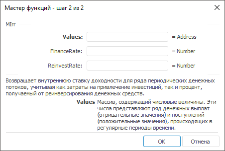

# MIrr: Регламентный отчёт, настольное приложение

MIrr: Регламентный отчёт, настольное приложение
-

# MIrr

[Мастер функций](../../UiReport_Organizational_master_function.htm)
 для функции MIrr выглядит следующим
 образом:

## Синтаксис

MIrr(Values, FinanceRate, ReinvestRate)

## Параметры

Values. Диапазон ячеек, содержащий
 числовые величины. Эти числа представляют ряд денежных выплат (отрицательные
 значения) и поступлений (положительные значения), происходящих в регулярные
 периоды времени;

FinanceRate. Ставка процента,
 выплачиваемого за деньги, используемые в денежных потоках;

ReinvestRate. Ставка процента,
 получаемого на денежные потоки при их реинвестировании.

Примечание.
 В качестве параметра можно указывать как непосредственно значение параметра,
 так и адрес ячейки, в которой оно располагается.

## Описание

Возвращает модифицированную внутреннюю ставку доходности для ряда периодических
 денежных потоков. Метод учитывает как затраты на привлечение инвестиций,
 так и процент, получаемый от реинвестирования денежных средств.

## Комментарии

MIrr использует порядок расположения
 чисел в данном параметре для определения порядка выплат и поступлений.
 Убедитесь, что значения выплат и поступлений введены в нужной последовательности
 и с правильными знаками (положительные значения для получаемых денег и
 отрицательные значения для выплачиваемых).

Функция вычисляется по формуле:

,

где:

	- Npv. Чистая приведенная
	 стоимость инвестиций [Npv](UiReport_Func_Finance_Npv.htm);

	- n. Количество чисел
	 в параметре Values.

## Пример

		 Формула
		 Результат
		 Описание

		 =MIrr(A0:C0, 0.15, 0.1)
		 1,04
		 Модифицированная внутренняя ставка доходности для ряда потоков
		 денежных средств, указанных в диапазоне A0:C0. В диапазоне A0:C0
		 содержатся следующие значения: -1, 1,5, 2,5.

		 =MIrr(A0:C0, 0.15, B6)
		 2,50
		 Модифицированная внутренняя ставка доходности для ряда потоков
		 денежных средств, указанных в диапазоне A0:C0. Ставка процента,
		 получаемого на денежных потоках при их реинвестировании, указана
		 в ячейке B6. В диапазоне A0:C0 содержатся следующие значения:
		 -0,5, 3, 2,5. Ячейка B6 содержит значение 0,21.

См. также:

[Мастер функций](../../UiReport_Organizational_master_function.htm)
 │ [Финансовые
 функции](UiReport_Func_Finance.htm) │ [Irr](UiReport_Func_Finance_Irr.htm)
 │ [XIrr](UiReport_Func_Finance_XIrr.htm)
 │ [IFinance.MIrr](MathLib.chm::/Interface/IFinance/IFinance.MIrr.htm)

		Справочная
		 система на версию 10.9
		 от 18/08/2025,
		 © ООО «ФОРСАЙТ»,
