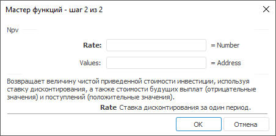

# Npv: Регламентный отчёт, настольное приложение

Npv: Регламентный отчёт, настольное приложение
-

# Npv

[Мастер функций](../../UiReport_Organizational_master_function.htm)
 для функции Npv выглядит следующим
 образом:

## Синтаксис

Npv(Rate, Values)

## Параметры

Rate. Ставка дисконтирования
 за один период;

Values. Диапазон ячеек, содержащий
 значения расходов и доходов.

Примечание.
 В качестве параметра можно указывать как непосредственно значение параметра,
 так и адрес ячейки, в которой оно располагается.

## Описание

Возвращает величину чистой приведенной стоимости инвестиции, используя
 ставку дисконтирования, а также стоимости будущих выплат (отрицательные
 значения) и поступлений (положительные значения).

## Комментарии

Значения параметра Values должны
 быть равномерно распределены во времени, выплаты должны осуществляться
 в конце каждого периода. Функция Npv
 использует порядок значений параметра Values
 для определения порядка поступлений и платежей. Убедитесь в том, что платежи
 и поступления введены в правильном порядке.

Считается, что инвестиция, значение которой вычисляет функция Npv, начинается за один период до
 даты денежного взноса Values
 и заканчивается с последним денежным взносом в списке. Вычисления функции
 Npv базируются на будущих денежных
 взносах. Если первый денежный взнос приходится на начало первого периода,
 то первое значение добавьте к результату функции Npv,
 но не включайте в список аргументов.

Функция вычисляется по формуле:

,

где:

	- n. Количество чисел в
	 параметре Values.

## Пример

		 Формула
		 Результат
		 Описание

		 =Npv(0.15, A0:C0)
		 3,68
		 Величина чистой приведенной стоимости инвестиции исходя из
		 ставки дисконтирования 0,15 и стоимости будущих выплат и поступлений,
		 указанных в диапазоне ячеек A0:C0. Диапазон ячеек A0:C0 содержит
		 следующие значения: -0,1, 1,5, 4.

		 =Npv(В6, A0:C0)
		 3,06
		 Величина чистой приведенной стоимости инвестиции исходя из
		 ставки дисконтирования, указанной в ячейке В6, и стоимости будущих
		 выплат и поступлений, указанных в диапазоне ячеек A0:C0. Диапазон
		 ячеек A0:C0 содержит следующие значения: -0,1, 1,5, 4. Ячейка
		 B6 содержит значение 0,23.

См. также:

[Мастер функций](../../UiReport_Organizational_master_function.htm)
 │ [Финансовые
 функции](UiReport_Func_Finance.htm) │ [Pv](UiReport_Func_Finance_Pv.htm)
 │ [Xnpv](UiReport_Func_Finance_Xnpv.htm)
 │ [IFinance.Npv](MathLib.chm::/Interface/IFinance/IFinance.Npv.htm)

		Справочная
		 система на версию 10.9
		 от 18/08/2025,
		 © ООО «ФОРСАЙТ»,
