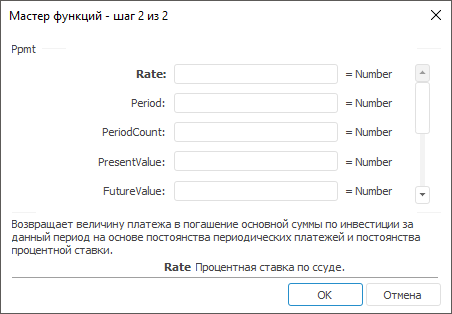

# Ppmt: Регламентный отчёт, настольное приложение

Ppmt: Регламентный отчёт, настольное приложение
-

# Ppmt

[Мастер функций](../../UiReport_Organizational_master_function.htm)
 для функции Ppmt выглядит следующим
 образом:

## Синтаксис

Ppmt(Rate, Period, PaymentCount, PresentValue, FutureValue,
 Type)

## Параметры

Rate. Процентная ставка по
 ссуде;

Period. Период;

PeriodCount. Общее число выплат
 по ссуде;

PresentValue. Приведенная к
 текущему моменту стоимость, или общая сумма, которая на текущий момент
 равноценна ряду будущих платежей, называемая также основной суммой;

FutureValue. Требуемое значение
 будущей стоимости, или остатка средств после последней выплаты;

Type. Выбор времени платежа.
 Параметр может принимать следующие значения:

	- 0.
	 Платеж в конце периода;

	- 1.
	 Платеж в начале периода.

Примечание.
 В качестве параметра можно указывать как непосредственно значение параметра,
 так и адрес ячейки, в которой оно располагается.

## Описание

Возвращает величину платежа в погашение основной суммы по инвестиции
 за данный на основе постоянства периодических платежей и постоянства процентной
 ставки.

## Пример

		 Формула
		 Результат
		 Описание

		 =Ppmt(0.01, 3, 12, 50000, 0, 0)
		 -4021,68
		 Величина платежа, в соответствии со следующими условиями:

			- процентная ставка 0,01;

			- период 3;

			- общее число выплат 12;

			- основная сумма 50000;

			- будущая стоимость 0;

			- платеж осуществляется в конце периода.

		 =Ppmt(A0, E0, B0, 12000, 0, 1)
		 541,58
		 Величина платежа, в соответствии со следующими условиями:

			- процентная ставка указана в ячейке A0, значение 0,2;

			- период указан в ячейке E0, значение 5;

			- общее число выплат указано в ячейке B0, значение 15;

			- основная сумма 12000;

			- будущая стоимость 0;

			- платеж осуществляется в начале периода.

См. также:

[Мастер функций](../../UiReport_Organizational_master_function.htm)
 │ [Финансовые
 функции](UiReport_Func_Finance.htm) │ [Pmt](UiReport_Func_Finance_Pmt.htm)
 │ [IFinance.Ppmt](MathLib.chm::/Interface/IFinance/IFinance.Ppmt.htm)

		Справочная
		 система на версию 10.9
		 от 18/08/2025,
		 © ООО «ФОРСАЙТ»,
