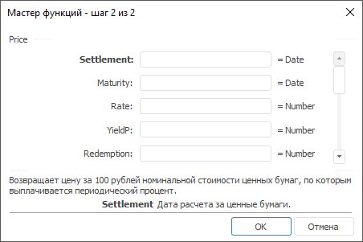

# Price: Регламентный отчёт, настольное приложение

Price: Регламентный отчёт, настольное приложение
-

# Price

[Мастер функций](../../UiReport_Organizational_master_function.htm)
 для функции Price выглядит следующим
 образом:

## Синтаксис

Price(Settlement, Maturity, Rate, YieldP, Redemption,
 Frequency[, Basis])

## Параметры

Settlement. Дата расчета за
 ценные бумаги. Эта дата более поздняя, чем дата выпуска, когда ценные
 бумаги были проданы покупателю;

Maturity. Срок погашения ценных
 бумаг. Эта дата определяет истечение срока действия ценных бумаг;

Rate. Годовая процентная ставка
 для купонов по ценным бумагам. Значение данного параметра должно быть
 больше либо равно нулю;

YieldP. Годовой доход по ценным
 бумагам. Значение данного параметра должно быть больше либо равно нулю;

Redemption. Выкупная стоимость
 ценных бумаг за 100 руб. номинальной стоимости. Значение данного
 параметра должно быть больше нуля;

Frequency. Количество выплат
 по купонам за год. Параметр может принимать следующие значения:

	- 1.
	 Ежегодные выплаты;

	- 2.
	 Полугодовые выплаты;

	- 4.
	 Ежеквартальные выплаты;

Basis. Используемый способ
 вычисления дня. Задается в интервале от 0 до 4:

	- 0.
	 Способ вычисления дня американский. 360 дней (метод NSAD). Значение
	 по умолчанию;

	- 1.
	 Способ вычисления дня фактический/фактический;

	- 2.
	 Способ вычисления дня фактический/360 дней;

	- 3.
	 Способ вычисления дня фактический/365 дней;

	- 4.
	 Способ вычисления дня европейский 30/360 дней.

Необязательный параметр.

Примечание.
 В качестве параметра можно указывать как непосредственно значение параметра,
 так и адрес ячейки, в которой оно располагается.

## Описание

Возвращает цену за 100 рублей номинальной стоимости ценных бумаг, по
 которым выплачивается периодический процент.

## Комментарии

Значение параметра Settlement
 должно быть меньше значения параметра Maturity.

## Пример

		 Формула
		 Результат
		 Описание

		 =Price("01.01.2008", "01.06.2008",
		 0.15, 0.2, 150, 1, 0)
		 144,18
		 Цена за 100 рублей номинальной стоимости ценных бумаг, в соответствии
		 со следующими условиями:

			- дата расчета 01.01.2008;

			- срок погашения 01.06.2008;

			- годовая процентная ставка 0,15;

			- годовой доход 0,2;

			- выкупная стоимость 150;

			- ежегодные выплаты по купонам;

			- используемый способ вычисления дня «американский».

		 =Price(A0, B0, 0.05, 0.35, 1510, 1, 0)
		 1208,41
		 Цена за 100 рублей номинальной стоимости ценных бумаг, в соответствии
		 со следующими условиями:

			- дата расчета указана в ячейке A0, значение 01.01.2007;

			- срок погашения указан в ячейке B0, значение 01.10.2007;

			- годовая процентная ставка 0,05;

			- годовой доход 0,35;

			- выкупная стоимость 1510;

			- ежегодные выплаты по купонам;

			- используемый способ вычисления дня «американский».

См. также:

[Мастер функций](../../UiReport_Organizational_master_function.htm)
 │ [Финансовые
 функции](UiReport_Func_Finance.htm) │ [PriceDisc](UiReport_Func_Finance_PriceDisc.htm)
 │ [PriceMat](UiReport_Func_Finance_PriceMat.htm) | [IFinance.Price](MathLib.chm::/Interface/IFinance/IFinance.Price.htm)

		Справочная
		 система на версию 10.9
		 от 18/08/2025,
		 © ООО «ФОРСАЙТ»,
