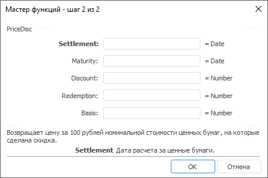
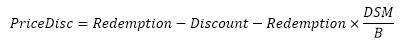

# PriceDisc: Регламентный отчёт, настольное приложение

PriceDisc: Регламентный отчёт, настольное приложение
-

# PriceDisc

[Мастер функций](../../UiReport_Organizational_master_function.htm)
 для функции PriceDisc выглядит
 следующим образом:

## Синтаксис

PriceDisc(Settlement, Maturity, Discount, Redemption[,
 Basis])

## Параметры

Settlement. Дата расчета за
 ценные бумаги. Эта дата более поздняя, чем дата выпуска, когда ценные
 бумаги были проданы покупателю;

Maturity. Срок погашения ценных
 бумаг. Эта дата определяет истечение срока действия ценных бумаг;

Discount. Скидка на ценную
 бумагу. Значение данного параметра должно быть больше, либо равно нулю;

Redemption. Выкупная стоимость
 ценных бумаг за 100 руб. номинальной стоимости. Значение данного
 параметра должно быть больше нуля;

Basis. Используемый способ
 вычисления дня. Задается в интервале от 0 до 4:

	- 0.
	 Способ вычисления дня американский. 360 дней (метод NSAD). Значение
	 по умолчанию;

	- 1.
	 Способ вычисления дня фактический/фактический;

	- 2.
	 Способ вычисления дня фактический/360 дней;

	- 3.
	 Способ вычисления дня фактический/365 дней;

	- 4.
	 Способ вычисления дня европейский 30/360 дней.

Необязательный параметр.

Примечание.
 В качестве параметра можно указывать как непосредственно значение параметра,
 так и адрес ячейки, в которой оно располагается.

## Описание

Возвращает цену за 100 рублей номинальной стоимости ценных бумаг, на
 которые сделана скидка.

## Комментарии

Значение параметра Settlement
 должно быть меньше значения параметра Maturity.

Данный метод вычисляется по формуле:

,

где:

	- DSM. Количество
	 дней от даты расчета до даты погашения;

	- B. Число дней в году,
	 зависит от выбранного значения параметра Basis.

## Пример

		 Формула
		 Результат
		 Описание

		 =PriceDisc("01.01.2008", "01.06.2008",
		 0.2, 150, 0)
		 137,50
		 Цена за 100 рублей номинальной стоимости ценных бумаг, в соответствии
		 со следующими условиями:

			- дата расчета 01.01.2008;

			- срок погашения 01.06.2008;

			- скидка 0,2;

			- выкупная стоимость 150;

			- используемый способ вычисления дня «американский».

		 =PriceDisc(A0, B0, 0.05, 1510)
		 1453,38
		 Цена за 100 рублей номинальной стоимости ценных бумаг, в соответствии
		 со следующими условиями:

			- дата расчета указана в ячейке A0, значение 01.01.2007;

			- срок погашения указан в ячейке B0, значение 01.10.2007;

			- скидка 0,05;

			- используемый способ вычисления дня «американский».

См. также:

[Мастер функций](../../UiReport_Organizational_master_function.htm)
 │ [Финансовые
 функции](UiReport_Func_Finance.htm) │ [Price](UiReport_Func_Finance_Price.htm)
 │ [PriceMat](UiReport_Func_Finance_PriceMat.htm) | [IFinance.PriceDisc](MathLib.chm::/Interface/IFinance/IFinance.PriceDisc.htm)

		Справочная
		 система на версию 10.9
		 от 18/08/2025,
		 © ООО «ФОРСАЙТ»,
