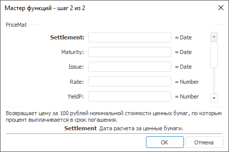

# PriceMat: Регламентный отчёт, настольное приложение

PriceMat: Регламентный отчёт, настольное приложение
-

# PriceMat

[Мастер функций](../../UiReport_Organizational_master_function.htm)
 для функции PriceMat выглядит
 следующим образом:

## Синтаксис

PriceMat(Settlement, Maturity, Issue, Rate, YieldP[,
 Basis])

## Параметры

Settlement. Дата расчета за
 ценные бумаги. Эта дата более поздняя, чем дата выпуска, когда ценные
 бумаги были проданы покупателю;

Maturity. Срок погашения ценных
 бумаг. Эта дата определяет истечение срока действия ценных бумаг;

Issue. Дата выпуска ценных
 бумаг. Значение данного параметра должно быть больше, либо равно нулю;

Rate. Процентная ставка дохода
 по ценным бумагам на дату выпуска. Значение данного параметра должно быть
 больше либо равно нулю;

YieldP. Годовой доход по ценным
 бумагам. Значение данного параметра должно быть больше либо равно нулю;

Basis. Используемый способ
 вычисления дня. Задается в интервале от 0 до 4:

	- 0.
	 Способ вычисления дня американский. 360 дней (метод NSAD). Значение
	 по умолчанию;

	- 1.
	 Способ вычисления дня фактический/фактический;

	- 2.
	 Способ вычисления дня фактический/360 дней;

	- 3.
	 Способ вычисления дня фактический/365 дней;

	- 4.
	 Способ вычисления дня европейский 30/360 дней.

Необязательный параметр.

Примечание.
 В качестве параметра можно указывать как непосредственно значение параметра,
 так и адрес ячейки, в которой оно располагается.

## Описание

Возвращает цену за 100 рублей номинальной стоимости ценных бумаг, по
 которым процент выплачивается в срок погашения.

## Комментарии

Значение параметра Settlement
 должно быть меньше значения параметра Maturity.

Данный метод вычисляется по формуле:

,

где:

	- B.
	 Количество дней в году, зависит от используемого базиса;

	- DSM.
	 Количество дней от даты расчета до даты погашения;

	- DIM.
	 Количество дней от даты выпуска до даты погашения;

	- A.
	 Количество дней от даты выпуска до даты расчета.

## Пример

		 Формула
		 Результат
		 Описание

		 =PriceMat("01.01.2008", "01.06.2008",
		 "01.10.2007", 0.15, 0.2, 0)
		 97,79
		 Цена за 100 рублей номинальной стоимости ценных бумаг, по которым
		 процент выплачивается в срок погашения, в соответствии со следующими
		 условиями:

			- дата расчета 01.01.2008;

			- срок погашения 01.06.2008;

			- дата выпуска 01.10.2007;

			- годовая процентная ставка 0,15;

			- процентная ставка дохода на дату выпуска 0,2;

			- используемый способ вычисления дня «американский».

		 =PriceMat(A0, B0, C0, 0.05, 0.35)
		 81,92
		 Цена за 100 рублей номинальной стоимости ценных бумаг, по которым
		 процент выплачивается в срок погашения, в соответствии со следующими
		 условиями:

			- дата расчета указана в ячейке A0, значение 01.01.2007;

			- срок погашения указан в ячейке B0, значение 01.10.2007;

			- дата выпуска указана в ячейке C0, значение 01.10.2006;

			- годовая процентная ставка 0,05;

			- процентная ставка дохода на дату выпуска 0,35;

			- используемый способ вычисления дня «американский».

См. также:

[Мастер функций](../../UiReport_Organizational_master_function.htm)
 │ [Финансовые
 функции](UiReport_Func_Finance.htm) │ [PriceDisc](UiReport_Func_Finance_PriceDisc.htm)
 │ [Price](UiReport_Func_Finance_Price.htm) | [IFinance.PriceMat](MathLib.chm::/Interface/IFinance/IFinance.PriceMat.htm)

		Справочная
		 система на версию 10.9
		 от 18/08/2025,
		 © ООО «ФОРСАЙТ»,
