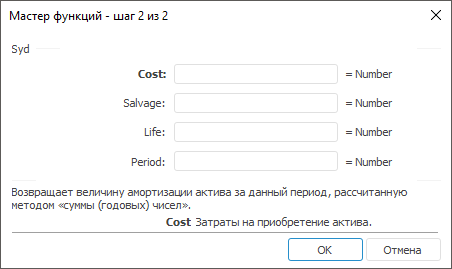
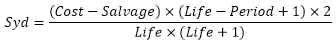

# Syd: Регламентный отчёт, настольное приложение

Syd: Регламентный отчёт, настольное приложение
-

# Syd

[Мастер функций](../../UiReport_Organizational_master_function.htm)
 для функции Syd выглядит следующим
 образом:

## Синтаксис

Syd(Cost, Salvage, Life, Period)

## Параметры

Cost. Затраты на приобретение
 актива;

Salvage. Стоимость в конце
 периода амортизации;

Life. Количество периодов,
 за которые актив амортизируется;

Period. Период. Должен быть
 измерен в тех же единицах, что и время полной амортизации.

Примечание.
 В качестве параметра можно указывать как непосредственно значение параметра,
 так и адрес ячейки, в которой оно располагается.

## Описание

Возвращает величину амортизации актива за данный период, рассчитанную
 методом «суммы (годовых) чисел».

## Комментарии

Функция вычисляется по формуле:

.

## Пример

		 Формула
		 Результат
		 Описание

		 =Syd(15000.1, 1000, 24,5)
		 933,34
		 Величина амортизации актива за период, в соответствии со
		 следующими условиями:

			- затраты на приобретение актива 15000,1;

			- стоимость в конце периода амортизации 1000;

			- количество периодов 24;

			- период 5.

		 =Syd(18764.41, 1456, A0, B0)
		 1619,50
		 Величина амортизации актива за период, в соответствии со
		 следующими условиями:

			- затраты на приобретение актива 18764,41;

			- стоимость в конце периода амортизации 1456;

			- количество периодов указано в ячейке A0, значение 18;

			- период указан в ячейке B0, значение 3.

См. также:

[Мастер функций](../../UiReport_Organizational_master_function.htm)
 │ [Финансовые
 функции](UiReport_Func_Finance.htm) │ [Db](UiReport_Func_Finance_Db.htm)
 │ [Ddb](UiReport_Func_Finance_Ddb.htm)
 │ [Sln](UiReport_Func_Finance_Sln.htm)
 │ [Vdb](UiReport_Func_Finance_Vdb.htm)
 │ [IFinance.Syd](MathLib.chm::/IFinance/IFinance.Syd.htm)

		Справочная
		 система на версию 10.9
		 от 18/08/2025,
		 © ООО «ФОРСАЙТ»,
