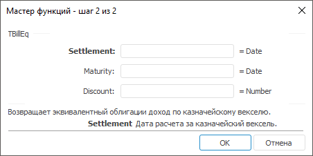

# TBillEq: Регламентный отчёт, настольное приложение

TBillEq: Регламентный отчёт, настольное приложение
-

# TBillEq

[Мастер функций](../../UiReport_Organizational_master_function.htm)
 для функции TBillEq выглядит следующим
 образом:

## Синтаксис

TBillEq(Settlement, Maturity, Discount)

## Параметры

Settlement. Дата расчета за
 казначейский вексель;

Maturity. Срок погашения для
 казначейского векселя;

Discount. Скидка на казначейский
 вексель.

Примечание.
 В качестве параметра можно указывать как непосредственно значение параметра,
 так и адрес ячейки, в которой оно располагается.

## Описание

Возвращает эквивалентный облигации доход по казначейскому векселю.

## Комментарии

Значение параметра Settlement должно
 быть меньше, либо равно значению параметра Maturity

Функция вычисляется по формуле:

,

где:

	- DSM. Количество дней
	 от даты расчета Settlement
	 до даты погашения Maturity,
	 вычисленное на основе 360-дневного года.

## Пример

		 Формула
		 Результат
		 Описание

		 =TBillEq("01.01.2007", "01.09.2008",
		 0.05)
		 0,06
		 Эквивалентный облигации доход по казначейскому векселю,
		 в соответствии со следующими условиями:

			- дата расчета 01.01.2007;

			- срок погашения 01.09.2008;

			- скидка 0,05.

		 =TBillEq(A0, B0, C0)
		 0,81
		 Эквивалентный облигации доход по казначейскому векселю,
		 в соответствии со следующими условиями:

			- дата расчета указана в ячейке A0, значение 01.01.2007;

			- срок погашения указан в ячейке B0, значение 01.10.2007;

			- скидка указана в ячейке С0, значение 0,5.

См. также:

[Мастер функций](../../UiReport_Organizational_master_function.htm)
 │ [Финансовые
 функции](UiReport_Func_Finance.htm) │ [TBillPrice](UiReport_Func_Finance_TBillPrice.htm)
 │ [TBillYield](UiReport_Func_Finance_TBillYield.htm)
 │ [IFinance.TBillEq](MathLib.chm::/IFinance/IFinance.TBillEq.htm)

		Справочная
		 система на версию 10.9
		 от 18/08/2025,
		 © ООО «ФОРСАЙТ»,
