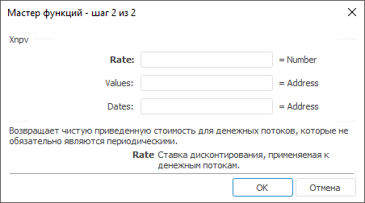
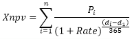

# Xnpv: Регламентный отчёт, настольное приложение

Xnpv: Регламентный отчёт, настольное приложение
-

# Xnpv

[Мастер функций](../../UiReport_Organizational_master_function.htm)
 для функции Xnpv выглядит следующим
 образом:

## Синтаксис

Xnpv(Rate, Values, Dates)

## Параметры

Rate. Ставка дисконтирования,
 применяемая к денежным потокам;

Values. Диапазон ячеек, содержащий
 значения денежных потоков, соответствующие графику платежей, приведенному
 в параметре Dates. Первый платеж
 является необязательным и соответствует выплате в начале инвестиции. Все
 последующие выплаты дисконтируются на основе 365-дневного года. Ряд значений
 должен содержать, по крайней мере, одно положительное и одно отрицательное
 значение;

Dates. Расписание дат платежей,
 которое соответствует ряду денежных потоков. Первая дата - начальная в
 графике платежей. Все другие даты должны быть позже этой даты, но могут
 идти в произвольном порядке.

Примечание.
 В качестве параметра можно указывать как непосредственно значение параметра,
 так и адрес ячейки, в которой оно располагается.

## Описание

Возвращает чистую приведенную стоимость для денежных потоков, которые
 не обязательно являются периодическими.

Функция Xnpv вычисляется следующим
 образом:

,

где:

	- di.
	 Дата i-ой или последней выплаты;

	- d1. Дата нулевой или
	 начальной выплаты;

	- Pi.
	 Сумма i-ой или последней
	 выплаты;

	- Rate. Скорость.

## Пример

		 Формула
		 Результат
		 Описание

		 =Xnpv(0.09, A0:Е0, A1:Е1)
		 2086,65
		 Величина чистой приведенной денежных потоков исходя из ставки
		 дисконтирования 0,09 и стоимости платежей, указанных в диапазоне
		 ячеек A0:E0. Расписание дат платежей приведено в диапазоне ячеек
		 A1:E1. В диапазоне A0:E0 содержатся следующие значения: -10000,
		 2750, 4250, 3250, 2750. В диапазоне A0:E0 содержатся следующие
		 значения: 01.01.2008, 01.03.2008, 03.10.2008, 15.02.2009, 01.04.2009.

См. также:

[Мастер функций](../../UiReport_Organizational_master_function.htm)
 │[Финансовые
 функции](UiReport_Func_Finance.htm) │[Npv](UiReport_Func_Finance_Npv.htm)
 │[Pv](UiReport_Func_Finance_Pv.htm)
 | [IFinance.Xnpv](MathLib.chm::/Interface/IFinance/IFinance.Xnpv.htm)

		Справочная
		 система на версию 10.9
		 от 18/08/2025,
		 © ООО «ФОРСАЙТ»,
