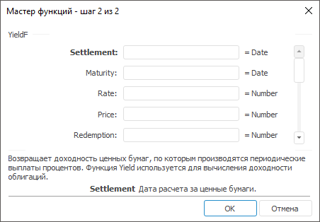

# YieldF: Регламентный отчёт, настольное приложение

YieldF: Регламентный отчёт, настольное приложение
-

# YieldF

[Мастер функций](../../UiReport_Organizational_master_function.htm)
 для функции YieldF выглядит следующим
 образом:

## Синтаксис

YieldF(Settlement, Maturity, Rate, Price, Redemption,
 Frequency[, Basis])

## Параметры

Settlement. Дата расчета за
 ценные бумаги. Эта дата более поздняя, чем дата выпуска, когда ценные
 бумаги были проданы покупателю;

Maturity. Срок погашения ценных
 бумаг. Эта дата определяет истечение срока действия ценных бумаг;

Rate. Годовая процентная ставка
 для купонов по ценным бумагам. Значение данного параметра должно быть
 больше либо равно нулю;

Price. Цена ценных бумаг за
 100 руб. номинальной стоимости. Значение данного параметра должно
 быть больше нуля;

Redemption. Выкупная стоимость
 ценных бумаг за 100 руб. номинальной стоимости. Значение данного
 параметра должно быть больше нуля;

Frequency. Количество выплат
 по купонам за год. Данный параметр может принимать следующие значения:

	- 1.
	 Ежегодные выплаты;

	- 2.
	 Полугодовые выплаты;

	- 4.
	 Ежеквартальные выплаты;

Basis. Используемый способ
 вычисления дня:

	- 0.
	 Способ вычисления дня американский. 360 дней (метод NSAD). Значение
	 по умолчанию;

	- 1.
	 Способ вычисления дня фактический/фактический;

	- 2.
	 Способ вычисления дня фактический/360 дней;

	- 3.
	 Способ вычисления дня фактический/365 дней;

	- 4.
	 Способ вычисления дня европейский 30/360 дней.

Необязательный параметр.

## Описание

Возвращает доходность ценных бумаг, по которым производятся периодические
 выплаты процентов. Функция используется для вычисления доходности облигаций.

## Комментарии

Значение параметра Settlement
 должно быть меньше, либо равно значению параметра Maturity.

Дата соглашения является датой продажи покупателю купона, например облигации.
 Срок платежа представляет собой дату истечения срока действия купона.

Если только один или менее периодов купона укладываются до даты погашения,
 функция YieldF вычисляется следующим
 образом:

,

где:

	- A. Количество дней
	 от начала периода купона до даты расчета (накопленные дни);

	- DSR. Количество
	 дней от даты расчета до даты погашения;

	- E. Количество дней
	 в периоде купона.

Если до погашения укладывается более одного периода купона, функция
 YieldF вычисляется итерационным
 методом (не более 100 итераций). Используется метод Ньютона на основе
 формулы для функции [Price](UiReport_Func_Finance_Price.htm).
 Доходность меняется до тех пор, пока вычисляемая цена для данной доходности
 не станет близкой к значению аргумента цена.

## Пример

		 Формула
		 Результат
		 Описание

		 =YieldF("01.01.2008", "01.06.2008",
		 0.15, 145, 150, 1, 0)
		 0,18
		 Доходность ценных бумаг, в соответствии со следующими условиями:

			- дата расчета 01.01.2008;

			- срок погашения 01.06.2008;

			- годовая процентная ставка 0,15;

			- цена за 100 руб. номинальной стоимости 145;

			- выкупная стоимость 150;

			- ежегодные выплаты по купонам;

			- используемый способ вычисления дня «американский».

		 =YieldF(A0, B0, 0.05, 1015.3, 1510, 1, 0)
		 0,65
		 Доходность ценных бумаг, в соответствии со следующими условиями:

			- дата расчета указана в ячейке A0, значение 01.01.2007;

			- срок погашения указан в ячейке B0, значение 01.10.2007;

			- годовая процентная ставка 0,05;

			- цена за 100 руб. номинальной стоимости 1015,3;

			- выкупная стоимость 1510;

			- ежегодные выплаты по купонам;

			- используемый способ вычисления дня «американский».

См. также:

[Мастер функций](../../UiReport_Organizational_master_function.htm)
 │ [Финансовые
 функции](UiReport_Func_Finance.htm) │ [Price](UiReport_Func_Finance_Price.htm)
 │ [YieldMat](UiReport_Func_Finance_YieldMat.htm) | [IFinance.YieldF](MathLib.chm::/Interface/IFinance/IFinance.YieldF.htm)

		Справочная
		 система на версию 10.9
		 от 18/08/2025,
		 © ООО «ФОРСАЙТ»,
