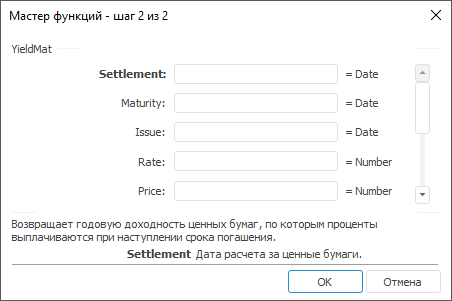

# YieldMat: Регламентный отчёт, настольное приложение

YieldMat: Регламентный отчёт, настольное приложение
-

# YieldMat

[Мастер функций](../../UiReport_Organizational_master_function.htm)
 для функции YieldMat выглядит
 следующим образом:

## Синтаксис

YieldMat(Settlement, Maturity, Issue, Rate, Price[,
 Basis])

## Параметры

Settlement. Дата расчета за
 ценные бумаги. Эта дата более поздняя, чем дата выпуска, когда ценные
 бумаги были проданы покупателю;

Maturity. Срок погашения ценных
 бумаг. Эта дата определяет истечение срока действия ценных бумаг;

Issue. Дата выпуска ценных
 бумаг;

Rate. Годовая процентная ставка
 для купонов по ценным бумагам. Значение данного параметра должно быть
 больше, либо равно нулю;

Price. Цена ценных бумаг за
 100 руб. номинальной стоимости. Значение данного параметра должно
 быть больше нуля;

Basis. Используемый способ
 вычисления дня. Задается в интервале от 0 до 4:

	- 0.
	 Способ вычисления дня американский. 360 дней (метод NSAD). Значение
	 по умолчанию;

	- 1.
	 Способ вычисления дня фактический/фактический;

	- 2.
	 Способ вычисления дня фактический/360 дней;

	- 3.
	 Способ вычисления дня фактический/365 дней;

	- 4.
	 Способ вычисления дня европейский 30/360 дней.

Необязательный параметр.

Примечание.
 В качестве параметра можно указывать как непосредственно значение параметра,
 так и адрес ячейки, в которой оно располагается.

## Описание

Возвращает годовую доходность ценных бумаг, по которым проценты выплачиваются
 при наступлении срока погашения.

## Комментарии

Значение параметра Settlement
 должно быть меньше, либо равно значению параметра Maturity.

Дата соглашения является датой продажи покупателю купона, например облигации.
 Срок платежа представляет собой дату истечения срока действия купона.

## Пример

		 Формула
		 Результат
		 Описание

		 =YieldMat("01.01.2008", "01.06.2008",
		 "01.10.2007", 0.15, 145.8, 0)
		 0,18
		 Годовая доходность ценных бумаг, в соответствии со следующими
		 условиями:

			- дата расчета 01.01.2008;

			- срок погашения 01.06.2008;

			- дата выпуска 01.10.2007;

			- процентная ставка 0,15;

			- цена за 100 руб. номинальной стоимости 98,47;

			- используемый способ вычисления дня «американский».

		 =YieldMat(A0, B0, C0, 0.05, 105.47)
		 -0,02
		 Годовая доходность ценных бумаг, в соответствии со следующими
		 условиями:

			- дата расчета указана в ячейке A0, значение 01.01.2007;

			- срок погашения указан в ячейке B0, значение 01.10.2007;

			- дата выпуска указана в ячейке C0, значение 01.10.2006;

			- годовая процентная ставка 0,05;

			- цена за 100 руб. номинальной стоимости 105,47;

			- используемый способ вычисления дня «американский».

См. также:

[Мастер
 функций](../../UiReport_Organizational_master_function.htm) │ [Финансовые функции](UiReport_Func_Finance.htm)
 │ [YieldF](UiReport_Func_Finance_YieldF.htm)
 | [IFinance.YieldMat](MathLib.chm::/Interface/IFinance/IFinance.YieldMat.htm)

		Справочная
		 система на версию 10.9
		 от 18/08/2025,
		 © ООО «ФОРСАЙТ»,
