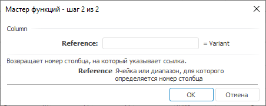

# Column: Регламентный отчёт, настольное приложение

Column: Регламентный отчёт, настольное приложение
-

# Column

[Мастер функций](../../UiReport_Organizational_master_function.htm)
 для функции Column:

## Синтаксис

Column(Reference)

## Параметры

Reference. Ячейка или диапазон.

## Описание

Возвращает номер столбца, на который указывает ссылка.

## Комментарии

Нумерация столбцов начинается с нуля.

## Пример

		 Формула
		 Результат
		 Описание

		 =Column(V4)
		 21
		 Номер столбца.

		 =Column( A1:C1)
		 0
		 Номер первого столбца диапазона.

См. также:

[Мастер
 функций](../../../../Web/organizational_management/UiReport_Organizational_master_function.htm) │ [Поиск](../../../../Web/organizational_management/Function/Find/Find.htm)

		Справочная
		 система на версию 10.9
		 от 18/08/2025,
		 © ООО «ФОРСАЙТ»,
