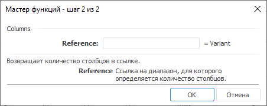

# Columns: Регламентный отчёт, настольное приложение

Columns: Регламентный отчёт, настольное приложение
-

# Columns

[Мастер функций](../../UiReport_Organizational_master_function.htm)
 для функции Columns:

## Синтаксис

Columns(Reference)

## Параметры

Reference. Ссылка на диапазон.

## Описание

Возвращает количество столбцов в ссылке.

## Пример

		 Формула
		 Результат
		 Описание

		 =Column( A1:C1)
		 3
		 Количество столбцов в диапазоне.

См. также:

[Мастер
 функций](../../../../Web/organizational_management/UiReport_Organizational_master_function.htm) │ [Поиск](../../../../Web/organizational_management/Function/Find/Find.htm)

		Справочная
		 система на версию 10.9
		 от 18/08/2025,
		 © ООО «ФОРСАЙТ»,
