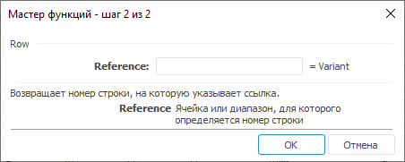

# Row: Регламентный отчёт, настольное приложение

Row: Регламентный отчёт, настольное приложение
-

# Row

[Мастер функций](../../UiReport_Organizational_master_function.htm)
 для функции Row:

## Синтаксис

Row(Reference)

## Параметры

Reference. Ячейка или диапазон.

## Описание

Возвращает номер строки, на которую указывает ссылка.

## Пример

		 Формула
		 Результат
		 Описание

		 =Row(V4)
		 4
		 Номер строки.

		 =Row( A1:A4)
		 1
		 Номер первой строки диапазона.

См. также:

[Мастер
 функций](../../../../Web/organizational_management/UiReport_Organizational_master_function.htm) │ [Поиск](../../../../Web/organizational_management/Function/Find/Find.htm)

		Справочная
		 система на версию 10.9
		 от 18/08/2025,
		 © ООО «ФОРСАЙТ»,
