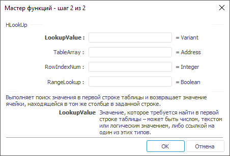

# HLookUp: Регламентный отчёт, настольное приложение

HLookUp: Регламентный отчёт, настольное приложение
-

# HLookUp

[Мастер функций](../../UiReport_Organizational_master_function.htm)
 для функции HLookUp выглядит
 следующим образом:

## Синтаксис

HLookUp(LookupValue, TableArray, RowIndexNum[, RangeLookup])

## Параметры

LookupValue. Значение, используемое
 при поиске нужного значения в массиве;

TableArray. Диапазон ячеек,
 в котором производится поиск;

RowIndexNum. Номер строки в
 диапазоне, из которой должно быть возвращено сопоставляемое значение;

RangeLookup. Необязательный
 параметр. Указывает, как должен производиться поиск:

		- True.
		 Приближенно. Значение по умолчанию;

		- False.
		 Точно.

## Описание

Выполняет поиск значения в первой строке таблицы и возвращает значение
 ячейки, находящейся в том же столбце в заданной строке.

## Комментарии

Функция работает по строкам. Нумерация строк начинается с 1.

Значение, используемое при поиске, может быть числом, текстом или логическим
 значением, либо ссылкой на один из этих типов.

## Пример

		 Формула
		 Результат
		 Описание

		 =HLookUp(A0, A1:A4, 3)
		 4
		 Возвращает значение ячейки, находящейся в столбце, указанном
		 в ячейке А0, в строке 3, в диапазоне ячеек от A1 до A4. Ячейка
		 А0 содержит значение «А». В диапазоне от A1 до A4 расположены
		 следующие числа: 2, 6, 4, -8.

См. также:

[Мастер функций](../../UiReport_Organizational_master_function.htm)
 │ [Ссылки
 и массивы](UiReport_Func_LinkArray.htm)

		Справочная
		 система на версию 10.9
		 от 18/08/2025,
		 © ООО «ФОРСАЙТ»,
