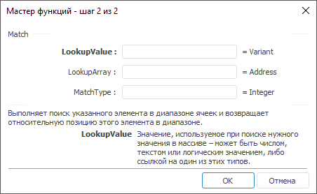

# Match: Регламентный отчёт, настольное приложение

Match: Регламентный отчёт, настольное приложение
-

# Match

[Мастер функций](../../UiReport_Organizational_master_function.htm)
 для функции Match выглядит
 следующим образом:

## Синтаксис

Match(LookupValue, LookupArray[, MatchType])

## Параметры

LookupValue. Значение, используемое
 при поиске нужного значения в массиве;

LookupArray. Диапазон ячеек,
 в котором производится поиск;

MatchType. Необязательный параметр.
 Указывает, каким образом искомое значение сопоставляется со значениями
 в диапазоне ячеек. Может принимать значения:

		- 1
		 или опущен. Функция находит наибольшее значение, которое
		 меньше или равно искомому значению, при этом диапазон ячеек должен
		 быть упорядочен по возрастанию. Значение по умолчанию;

		- 0.
		 Функция находит первое значение, равное искомому значению, при
		 этом диапазон ячеек может быть не упорядочен;

		- -1.
		 Функция находит наименьшее значение, которое больше или равно
		 искомому значению, при этом диапазон ячеек должен быть упорядочен
		 по убыванию.

## Описание

Выполняет поиск указанного элемента в диапазоне ячеек и возвращает относительную
 позицию этого элемента в диапазоне.

## Комментарии

Диапазон ячеек должен быть непрерывным столбцом или строкой.

Значение, используемое при поиске, может быть числом, текстом или логическим
 значением, либо ссылкой на один из этих типов.

## Пример

		 Формула
		 Результат
		 Описание

		 =Match(6, A1:A4, 0)
		 2
		 Возвращает позицию элемента, значение которого 6, в диапазоне
		 ячеек от A1 до A4, ищет первое значение, при этом диапазон ячеек
		 не упорядочен. В данном диапазоне расположены следующие числа:
		 2, 6, 4, -8.

См. также:

[Мастер функций](../../UiReport_Organizational_master_function.htm)
 │ [Ссылки
 и массивы](UiReport_Func_LinkArray.htm)

		Справочная
		 система на версию 10.9
		 от 18/08/2025,
		 © ООО «ФОРСАЙТ»,
