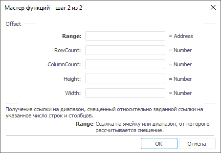

# Offset: Регламентный отчёт, настольное приложение

Offset: Регламентный отчёт, настольное приложение
-

# Offset

[Мастер функций](../../UiReport_Organizational_master_function.htm)
 для функции Offset выглядит
 следующим образом:

## Синтаксис

Offset(Range, RowCount, ColumnCount [,Height[, Width])

## Параметры

Range. Диапазон, от которого
 будет производиться смещение.

RowCount. Количество строк,
 на которые необходимо сместить диапазон;

ColumnCount. Количество столбцов,
 на которые необходимо сместить диапазон;

Height. Высота возвращаемого
 диапазона в ячейках. Необязательный параметр;

Width. Ширина возвращаемого
 диапазона в ячейках. Необязательный параметр.

## Описание

Возвращает ссылки на диапазон ячеек, смещенный относительно заданной
 ссылки на указанное число строк и столбцов.

## Комментарии

Смещение производится на RowCount
 строк, ColumnCount столбцов и
 рассчитывается от диапазона Range.
 По умолчанию, высота и ширина возвращаемого диапазона совпадает с шириной
 и высотой исходного диапазона. Используя параметры Height
 и Width, можно задать высоту
 и ширину возвращаемого диапазона.

В качестве значений параметров RowCount,
 ColumnCount, Height,
 Width можно указывать как непосредственно
 значение параметра, так и адрес ячейки, в которой оно располагается.

Если в качестве параметра Range
 требуется передать одиночную ячейку, а не диапазон, используйте функцию
 [Rng](UiReport_Func_LinkArray_Rng.htm),
 которая возвращает диапазон ячейки.

## Пример

		 Формула
		 Результат
		 Описание

		 =sum(offset(A0:C0,1,0))
		 6
		 Сумма чисел в диапазоне ячеек от A1 до C1. Данный диапазон
		 смещен на строку вниз от диапазона ячеек от A0 до C0 и содержит
		 следующие числа: 1, 2, 3.

		 =sum(offset(A1:C1,-1,0))
		 15
		 Сумма чисел в диапазоне ячеек от A0 до C0. Данный диапазон
		 смещен на строку вверх от диапазона ячеек от A1 до C1 и содержит
		 следующие числа: 6, 5, 4.

		 =sum(offset(Rng(B1),-1,-1))
		 5
		 Число в ячейке A0, расположенной на строку выше и столбец левее
		 ячейки B1. Ячейка A0 содержит значение 5.

		 =sum(offset(A0:C0,-1,0))
		 Недопустимый индекс элемента!
		 Диапазон, возвращаемый функцией Offset,
		 выходит за пределы таблицы.

См. также:

[Мастер функций](../../UiReport_Organizational_master_function.htm)
 │ [Ссылки
 и массивы](UiReport_Func_LinkArray.htm)

		Справочная
		 система на версию 10.9
		 от 18/08/2025,
		 © ООО «ФОРСАЙТ»,
