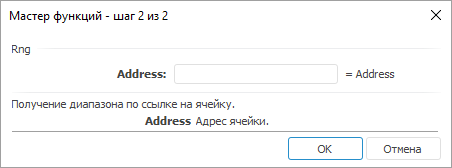

# Rng: Регламентный отчёт, настольное приложение

Rng: Регламентный отчёт, настольное приложение
-

# Rng

[Мастер функций](../../UiReport_Organizational_master_function.htm)
 для функции Rng выглядит следующим
 образом:

## Синтаксис

Rng(Address)

## Параметры

Address. Адрес ячейки.

## Описание

Возвращает диапазон по ссылке на ячейку.

## Комментарии

Если в качестве адреса передается адрес диапазона, то функция работает
 аналогично функции [Range](UiReport_Func_LinkArray_Range.htm).

## Пример

		 Формула
		 Результат
		 Описание

		 =sum(offset(Rng(B1),-1,-1))
		 5
		 Число в ячейке A0, расположенной на строку выше и столбец левее
		 ячейки B1. Ячейка A0 содержит значение 5.

См. также:

[Мастер функций](../../UiReport_Organizational_master_function.htm)
 │ [Ссылки
 и массивы](UiReport_Func_LinkArray.htm)

		Справочная
		 система на версию 10.9
		 от 18/08/2025,
		 © ООО «ФОРСАЙТ»,
