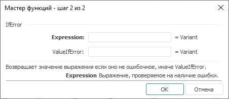

# IfError: Регламентный отчёт, настольное приложение

IfError: Регламентный отчёт, настольное приложение
-

# IfError

[Мастер функций](../../UiReport_Organizational_master_function.htm)
 для функции IfError:

## Синтаксис

IfError(Expression, ValueIfError)

## Параметры

Expression. Выражение;

ValueIfError. Значение, если
 в выражении ошибка.

## Описание

Возвращает выражение, если оно не содержит ошибки, иначе указанное значение.

## Комментарии

В качестве значения параметров могут быть числа, пустые ячейки, логические
 значения, ссылки на ячейки, формулы.

При использовании диапазона значений в качестве возвращаемого значения
 будет использовано значение левой верхней ячейки.

Если диапазон выражений не содержит ошибок, то в качестве возвращаемого
 значения будет использовано значение левой верхней ячейки. Если диапазон
 выражений содержит хотя бы одну ошибку, то будет возвращено указанное
 значение.

## Пример

		 Формула
		 Результат
		 Описание

		 =IfError(J11:K12,
		 J7:K10)
		 True
		 Значение левой верхней ячейки диапазона выражений, который
		 не содержит ошибок.

См. также:

[Мастер
 функций](../../../../Web/organizational_management/UiReport_Organizational_master_function.htm) │
 [Логические
 функции](../../../../Web/organizational_management/Function/Logical/UiReport_Func_Logical.htm)

		Справочная
		 система на версию 10.9
		 от 18/08/2025,
		 © ООО «ФОРСАЙТ»,
