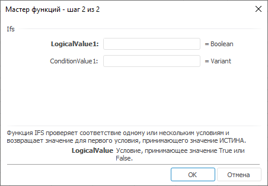

# Ifs: Регламентный отчёт, настольное приложение

Ifs: Регламентный отчёт, настольное приложение
-

# Ifs

[Мастер функций](../../UiReport_Organizational_master_function.htm)
 для функции Ifs:

## Синтаксис

Ifs(LogicalValue1, ConditionValue1, …)

## Параметры

LogicalValue1, LogicalValue2, …, LogicalValueN.
 Логическое условие;

ConditionValue1, ConditionValue2,
 …, ConditionValueN. Значение, если условие принимает значение ИСТИНА.

## Описание

Проверяет соответствие одному или нескольким условиям и возвращает значение
 для первого условия, принимающего значение ИСТИНА.

## Комментарии

Задать можно до 127 условий.

В качестве значения параметров могут быть числа, пустые ячейки, логические
 значения, ссылки на ячейки, формулы.

Числа интерпретируются как True,
 пустые ячейки - False.

## Пример

		 Формула
		 Результат
		 Описание

		 =Ifs(K7, 1, K8,
		 2, G10, 4)
		 4
		 Значение для третьего условия, которое первым принимает значение
		 True.

См. также:

[Мастер
 функций](../../../../Web/organizational_management/UiReport_Organizational_master_function.htm) │
 [Логические
 функции](../../../../Web/organizational_management/Function/Logical/UiReport_Func_Logical.htm)

		Справочная
		 система на версию 10.9
		 от 18/08/2025,
		 © ООО «ФОРСАЙТ»,
