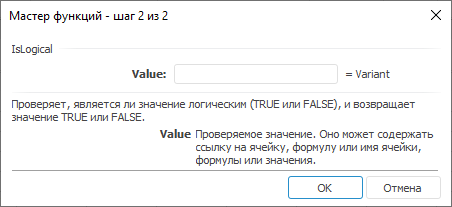

# IsLogical: Регламентный отчёт, настольное приложение

IsLogical: Регламентный отчёт, настольное приложение
-

# IsLogical

[Мастер функций](../../UiReport_Organizational_master_function.htm)
 для функции IsLogical:

## Синтаксис

IsLogical(Value)

## Параметры

Value. Проверяемое значение.

## Описание

Проверяет, является ли значение логическим.

## Комментарии

Возвращает TRUE, если значение
 является логическим, в противном случае возвращает FALSE.

В качестве значения параметра могут быть числа, пустые ячейки, логические
 значения, текст, ссылки на ячейки, формулы.

## Пример

		 Формула
		 Результат
		 Описание

		 =IsLogical(C2:E9)
		 TRUE
		 Диапазон ячеек C2:E9 содержит только логические значения.

См. также:

[Мастер
 функций](../../../../Web/organizational_management/UiReport_Organizational_master_function.htm) │
 [Логические
 функции](../../../../Web/organizational_management/Function/Logical/UiReport_Func_Logical.htm)

		Справочная
		 система на версию 10.9
		 от 18/08/2025,
		 © ООО «ФОРСАЙТ»,
