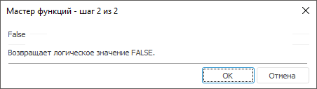

# False: Регламентный отчёт, настольное приложение

False: Регламентный отчёт, настольное приложение
-

# False

[Мастер функций](../../UiReport_Organizational_master_function.htm)
 для функции False выглядит следующим
 образом:

## Синтаксис

False ()

## Параметры

Функция не содержит параметров.

## Описание

Возвращает логическое значение FALSE.

См. также:

[Мастер функций](../../UiReport_Organizational_master_function.htm) │
 [Логические
 функции](UiReport_Func_Logical.htm)

		Справочная
		 система на версию 10.9
		 от 18/08/2025,
		 © ООО «ФОРСАЙТ»,
