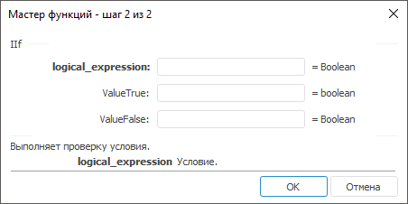

# IIf: Регламентный отчёт, настольное приложение

IIf: Регламентный отчёт, настольное приложение
-

# IIf

[Мастер функций](../../UiReport_Organizational_master_function.htm)
 для функции IIf выглядит следующим
 образом:

## Синтаксис

IIf(Logical_expression, ValueTrue, ValueFalse)

## Параметры

Logical_expression. Определяет
 условие, которое проверяется данной функцией;

ValueTrue. Определяет значение,
 в случае если условие верно;

ValueFalse. Определяет значение,
 в случае если условие неверно.

## Описание

Выполняет проверку условия.

Примечание.
 Если нужно проверить несколько условий, используйте функцию для каждого
 отдельно.

## Комментарии

Функция IIf является эквивалентом
 условного оператора [?:](Fore.chm::/08_Operators/Fore_If.htm),
 который тоже может быть использован в регламентном отчете.

Отличие функции IIf от условного
 оператора ?::

	- IIf(Logical_expression, ValueTrue,
	 ValueFalse)

	IIf сначала вычисляет значения
	 Logical_expression, ValueTrue, ValueFalse,
	 а затем в зависимости от результата Logical_expression
	 возвращает значение ValueTrue
	 или ValueFalse;

	- Logical_expression
	 ? ValueTrue : ValueFalse

	Условный оператор ? сначала
	 вычисляет значение Logical_expression,
	 а затем в зависимости от результата вычисляет или ValueTrue,
	 или ValueFalse.

## Пример

		 Формула
		 Результат
		 Описание

		 =IIf(C0>B0, C0, B0)
		 7
		 Сравнивает значения в ячейках C0, B0 и возвращает наибольшее
		 значение. Ячейка C0 содержит значение 7, ячейка B0 - значение
		 2.

		 =IIf(C0>B0, A0+2, A0-2)
		 2
		 Сравнивает значения в ячейках C0, B0 и возвращает значение
		 ячейки A0 увеличенное на два, Ячейка C0 содержит значение 6, ячейка
		 B0 - значение 5, ячейка A0 - значение 0.

Если бы значение в ячейке C0 было бы меньше,
		 чем значение в ячейке B0, то функция вернула бы значение ячейки
		 A0 уменьшенное на два.

		 =IIf(C0>B0, "Да", "Нет")
		 Да
		 Результат проверки условия: значение в ячейке C0 больше, чем
		 значение в ячейке B0. Ячейка C0 содержит значение 6, ячейка B0
		 - значение 5.

См. также:

[Мастер функций](../../UiReport_Organizational_master_function.htm) │
 [Логические
 функции](UiReport_Func_Logical.htm)

		Справочная
		 система на версию 10.9
		 от 18/08/2025,
		 © ООО «ФОРСАЙТ»,
