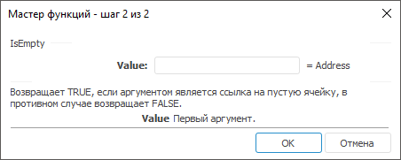

# IsEmpty: Регламентный отчёт, настольное приложение

IsEmpty: Регламентный отчёт, настольное приложение
-

# IsEmpty

[Мастер функций](../../UiReport_Organizational_master_function.htm)
 для функции IsEmpty выглядит следующим
 образом:

## Синтаксис

IsEmpty(Value)

## Параметры

Value. Определяет значение
 первого аргумента.

## Описание

Возвращает TRUE, если аргументом
 является ссылка на пустую ячейку, в противном случае возвращает FALSE.

См. также:

[Мастер функций](../../UiReport_Organizational_master_function.htm) │
 [Логические
 функции](UiReport_Func_Logical.htm)

		Справочная
		 система на версию 10.9
		 от 18/08/2025,
		 © ООО «ФОРСАЙТ»,
