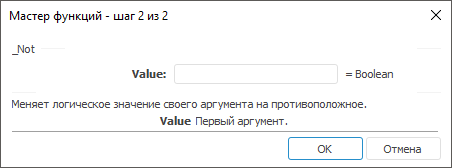

# _Not: Регламентный отчёт, настольное приложение

_Not: Регламентный отчёт, настольное приложение
-

# _Not

[Мастер функций](../../UiReport_Organizational_master_function.htm)
 для функции _Not выглядит следующим
 образом:

## Синтаксис

_Not(Value)

## Параметры

Value. Определяет первый аргумент.

## Описание

Меняет логическое значение своего аргумента на противоположное.

См. также:

[Мастер функций](../../UiReport_Organizational_master_function.htm) │
 [Логические
 функции](UiReport_Func_Logical.htm)

		Справочная
		 система на версию 10.9
		 от 18/08/2025,
		 © ООО «ФОРСАЙТ»,
