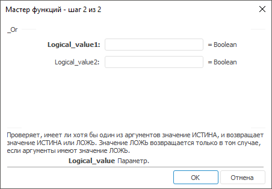

# _Or: Регламентный отчёт, настольное приложение

_Or: Регламентный отчёт, настольное приложение
-

# _Or

[Мастер функций](../../UiReport_Organizational_master_function.htm)
 для функции _Or выглядит следующим
 образом:

## Синтаксис

_Or(Logical_Value, ...)

## Параметры

Logical Value1, Logical Value2, …,
 Logical ValueN. Определяет значения аргументов, которые проверяются
 данной функцией.

## Описание

Проверяет, имеет ли хотя бы один из аргументов значение «ИСТИНА», и
 возвращает значение «ИСТИНА» или «ЛОЖЬ». Значение «ЛОЖЬ» возвращается
 только в том случае, если аргументы имеют значение «ЛОЖЬ».

См. также:

[Мастер функций](../../UiReport_Organizational_master_function.htm) │
 [Логические
 функции](UiReport_Func_Logical.htm)

		Справочная
		 система на версию 10.9
		 от 18/08/2025,
		 © ООО «ФОРСАЙТ»,
