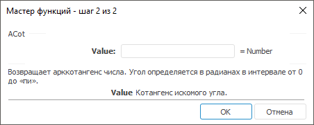

# ACot: Регламентный отчёт, настольное приложение

ACot: Регламентный отчёт, настольное приложение
-

# ACot

[Мастер функций](../../UiReport_Organizational_master_function.htm)
 для функции ACot выглядит следующим
 образом:

## Синтаксис

ACot(Value)

## Параметры

Value. Котангенс искомого угла.
 Любое действительное число.

Примечание.
 В качестве параметра можно указывать как непосредственно число, так и
 адрес ячейки, в которой оно располагается.

## Описание

Возвращает арккотангенс числа.

## Комментарии

Арккотангенс числа - это угол, котангенс которого равен числу. Угол
 определяется в радианах в интервале от 0 до «Пи».

## Пример

		 Формула
		 Результат
		 Описание

		 = ACot(A1)
		 0,4636
		 Арккотангенс числа, расположенного в ячейке A1, в радианах.
		 Ячейка A1 содержит число 2.

		 = ACot(0)
		 1,5708
		 Арккотангенс числа 0 в радианах.

Примечание.
 Если нужно преобразовать результат из радиан в градусы, используйте функцию
 [Degrees](UiReport_Func_Math_Degrees.htm).

См. также:

[Мастер функций](../../UiReport_Organizational_master_function.htm) │
 [Математические
 функции](UiReport_Func_math.htm) │ [ACotH](ACotH.htm) │ [IMath.ACot](MathLib.chm::/Interface/IMath/IMath.ACot.htm)

		Справочная
		 система на версию 10.9
		 от 18/08/2025,
		 © ООО «ФОРСАЙТ»,
