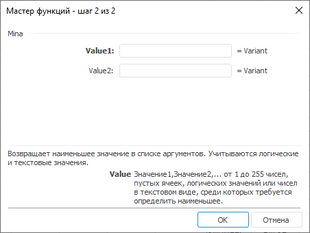

# Mina: Регламентный отчёт, настольное приложение

Mina: Регламентный отчёт, настольное приложение
-

# Mina

[Мастер функций](../../UiReport_Organizational_master_function.htm)
 для функции Mina:

## Синтаксис

Mina(Value1,...)

## Параметры

Value1, Value2, …, ValueN.
 Диапазон ячеек, для которых будет определено минимальное значение.

## Описание

Возвращает минимальное число в массиве ячеек, содержащем не только числовые
 значения.

## Комментарии

В качестве значения параметра могут быть числа, пустые ячейки, логические
 значения, текст, ссылки на ячейки, формулы. Количество значений может
 быть от 1 до 255.

Значение True интерпретируется
 как -1, текстовые значения и False
 интерпретируются как 0.

Допускается использование только латиницы.

## Пример

		 Формула
		 Результат
		 Описание

		 =Mina(A7:A9, A11, A6)
		 2
		 Минимальное число в массиве, расположенного в ячейках A7:A9,
		 A11, A6. Ячейка A6 содержит число 180, A7 содержит число 2, A8
		 содержит число 270, A9 содержит число 50, A11 содержит число
		 100.

		 =Mina(true, false, 15, 10)
		 -1
		 Минимальное число в заданном массиве, соответствующее значению
		 True.

См. также:

[Мастер
 функций](../../../../Web/organizational_management/UiReport_Organizational_master_function.htm) │ [Математические
 функции](../../../../Web/organizational_management/Function/Math/UiReport_Func_math.htm)

		Справочная
		 система на версию 10.9
		 от 18/08/2025,
		 © ООО «ФОРСАЙТ»,
