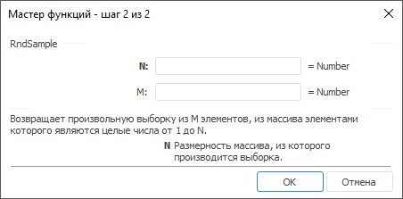

# RndSample: Регламентный отчёт, настольное приложение

RndSample: Регламентный отчёт, настольное приложение
-

# RndSample

[Мастер функций](../../UiReport_Organizational_master_function.htm)
 для функции RndSample выглядит
 следующим образом:

## Синтаксис

RndSample(N, M)

## Параметры

N. Размерность искомого массива,
 наибольшее значение в нем. Значение параметра должно быть не меньше, чем
 единица;

M. Количество чисел для выборки.
 Значение параметра M не должно
 превышать значение параметра N.
 Значение параметра должно быть
 не меньше, чем единица.

Примечание.
 В качестве параметра можно указывать как непосредственно число, так и
 адрес ячейки, в которой оно располагается.

## Описание

Возвращает произвольную выборку из M элементов из массива, элементами
 которого являются целые числа от 1 до N.

## Комментарии

Функция возвращает массив, поэтому должна быть введена как [формула
 массива](../UiReport_Function.htm). Если ввести формулу в одну ячейку, то будет отображен элемент
  обратной
 матрицы.

## Пример

		 Формула
		 Результат
		 Описание

		 = RndSample(A1, 2)
		 Меняется.
		 Выборка случайных чисел между 1 и значением, содержащимся в
		 ячейке A1. В выборке будет два числа.

		 = RndSample(5, 2)
		 Меняется.
		 Выборка случайных чисел между 1 и 5. В выборке будет два числа.

Формулу в этом примере необходимо ввести как формулу массива.
 Для этого:

	- Введите формулу в ячейку;

	- Выделите диапазон по величине равный исходной матрице, начиная
	 с ячейки, содержащей формулу;

	- Нажмите клавишу F2, а затем — клавиши CTRL+SHIFT+ENTER.

Если формула не будет введена как формула массива, то будет отображено
 значение 
 обратной матрицы.

См. также:

[Мастер функций](../../UiReport_Organizational_master_function.htm) │
 [Математические
 функции](UiReport_Func_math.htm) │ [IMath.RndSample](MathLib.chm::/Interface/IMath/IMath.RndSample.htm)

		Справочная
		 система на версию 10.9
		 от 18/08/2025,
		 © ООО «ФОРСАЙТ»,
