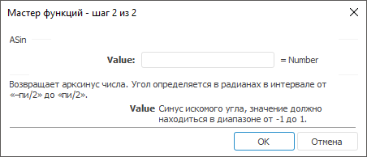

# ASin: Регламентный отчёт, настольное приложение

ASin: Регламентный отчёт, настольное приложение
-

# ASin

[Мастер функций](../../UiReport_Organizational_master_function.htm)
 для функции ASin выглядит следующим
 образом:

## Синтаксис

ASin(Value)

## Параметры

Value. Синус искомого угла.
 Допустимые значения находятся в диапазоне от -1 до 1.

Примечание.
 В качестве параметра можно указывать как непосредственно число, так и
 адрес ячейки, в которой оно располагается.

## Описание

Возвращает арксинус числа.

## Комментарии

Арксинус числа - это угол, синус которого равняется числу. Угол определяется
 в радианах в интервале от «-Пи/2» до «Пи/2».

## Пример

		 Формула
		 Результат
		 Описание

		 = ASin(B6)
		 0,1002
		 Арксинус числа, расположенного в ячейке B6, в радианах. Ячейка
		 B6 содержит число 0,1.

		 = ASin(-0.6)
		 0,6435
		 Арксинус числа -0,6 в радианах.

Примечание.
 Если нужно преобразовать результат из радиан в градусы, используйте функцию
 [Degrees](UiReport_Func_Math_Degrees.htm).

См. также:

[Мастер функций](../../UiReport_Organizational_master_function.htm)
 │ [Математические
 функции](UiReport_Func_math.htm) │ [Sin](UiReport_Func_Math_Sin.htm)
 │ [SinH](UiReport_Func_Math_SinH.htm)
 │ [ASinH](UiReport_Func_Math_ASinH.htm)
 │[Degrees](UiReport_Func_Math_Degrees.htm) │
 [IMath.ASin](MathLib.chm::/Interface/IMath/IMath.ASin.htm)

		Справочная
		 система на версию 10.9
		 от 18/08/2025,
		 © ООО «ФОРСАЙТ»,
