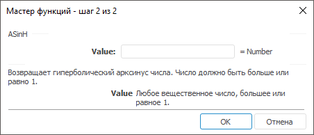

# ASinH: Регламентный отчёт, настольное приложение

ASinH: Регламентный отчёт, настольное приложение
-

# ASinH

[Мастер функций](../../UiReport_Organizational_master_function.htm)
 для функции ASinH выглядит следующим
 образом:

## Синтаксис

ASinH(Value)

## Параметры

Value. Вещественное число,
 от которого требуется найти гиперболический арксинус.

Примечание.
 В качестве параметра можно указывать как непосредственно число, так и
 адрес ячейки, в которой оно располагается.

## Описание

Возвращает гиперболический арксинус числа.

## Комментарии

Гиперболический арксинус числа - это значение, гиперболический синус
 которого равен числу. Число должно быть больше или равно 1.

## Пример

		 Формула
		 Результат
		 Описание

		 =ASinH(B6)
		 0,0998
		 Гиперболический арксинус числа в ячейке B6. Ячейка B6 содержит
		 число 0,1.

		 =ASinH(2.5)
		 1,6472
		 Гиперболический арксинус числа 2,5.

См. также:

[Мастер функций](../../UiReport_Organizational_master_function.htm)
 │ [Математические
 функции](UiReport_Func_math.htm) │ [Sin](UiReport_Func_Math_Sin.htm)
 │ [SinH](UiReport_Func_Math_SinH.htm)
 │ [ASin](UiReport_Func_Math_ASin.htm) │
 [IMath.ASinH](MathLib.chm::/Interface/IMath/IMath.ASinH.htm)

		Справочная
		 система на версию 10.9
		 от 18/08/2025,
		 © ООО «ФОРСАЙТ»,
