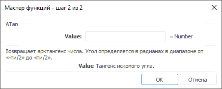

# ATan: Регламентный отчёт, настольное приложение

ATan: Регламентный отчёт, настольное приложение
-

# ATan

[Мастер функций](../../UiReport_Organizational_master_function.htm)
 для функции ATan выглядит следующим
 образом:

## Синтаксис

ATan(Value)

## Параметры

Value. Тангенс искомого угла.

Примечание.
 В качестве параметра можно указывать как непосредственно число, так и
 адрес ячейки, в которой оно располагается.

## Описание

Возвращает арктангенс числа.

## Комментарии

Арктангенс числа - это угол, тангенс которого равен числу. Угол определяется
 в радианах в диапазоне от «-Пи/2» до «Пи/2».

## Пример

		 Формула
		 Результат
		 Описание

		 =ATan(B6)
		 -1,1264
		 Арктангенс числа, расположенного в ячейке B6, в радианах. Ячейка
		 B6 содержит число -2,3.

		 =ATan(1)
		 0,7853
		 Арктангенс числа 1 в радианах.

Примечание.
 Если нужно преобразовать результат из радиан в градусы, используйте функцию
 [Degrees](UiReport_Func_Math_Degrees.htm).

См. также:

[Мастер функций](../../UiReport_Organizational_master_function.htm)
 │ [Математические
 функции](UiReport_Func_math.htm) │ [Degrees](UiReport_Func_Math_Degrees.htm)
 │ [ATan2](UiReport_Func_Math_ATan2.htm)
 │ [ATanH](UiReport_Func_Math_ATanH.htm)
 │ [Tan](UiReport_Func_Math_Tan.htm)
 │ [TanH](UiReport_Func_Math_TanH.htm) │
 [IMath.ATan](MathLib.chm::/Interface/IMath/IMath.ATan.htm)

		Справочная
		 система на версию 10.9
		 от 18/08/2025,
		 © ООО «ФОРСАЙТ»,
