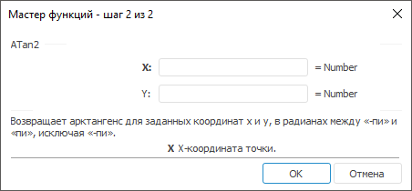

# ATan2: Регламентный отчёт, настольное приложение

ATan2: Регламентный отчёт, настольное приложение
-

# ATan2

[Мастер функций](../../UiReport_Organizational_master_function.htm)
 для функции ATan2 выглядит следующим
 образом:

## Синтаксис

ATan2(X, Y)

## Параметры

X. X-координата точки;

Y. Y-координата точки.

Примечание.
 В качестве параметра можно указывать как непосредственно число, так и
 адрес ячейки, в которой оно располагается.

## Описание

Возвращает арктангенс для заданных координат X и Y.

## Комментарии

Арктангенс - это угол между осью X и линией, проведенной из точки (0,
 0) в точку (X, Y). Угол определяется в радианах в диапазоне от «-Пи» до
 «Пи», исключая «-Пи».

## Пример

		 Формула
		 Результат
		 Описание

		 =ATan2(1, -1)
		 -0,7854
		 Арктангенс точки с координатами (1, -1) в радианах.

		 =ATan2(A3, A4)
		 0,4636
		 Арктангенс точки с координатами, заданными в ячейках A3 и A4.
		 В ячейке А3 находится число 2, в А4 находится число 1.

Примечание.
 Если нужно преобразовать результат из радиан в градусы, используйте функцию
 [Degrees](UiReport_Func_Math_Degrees.htm).

См. также:

[Мастер функций](../../UiReport_Organizational_master_function.htm)
 │ [Математические
 функции](UiReport_Func_math.htm) │ [ATan](UiReport_Func_Math_ATan.htm)
 │ [ATanH](UiReport_Func_Math_ATanH.htm)
 │ [Tan](UiReport_Func_Math_Tan.htm)
 │ │ [TanH](UiReport_Func_Math_TanH.htm)
 │ [Degrees](UiReport_Func_Math_Degrees.htm) │
 [IMath.ATan2](MathLib.chm::/Interface/IMath/IMath.ATan2.htm)

		Справочная
		 система на версию 10.9
		 от 18/08/2025,
		 © ООО «ФОРСАЙТ»,
