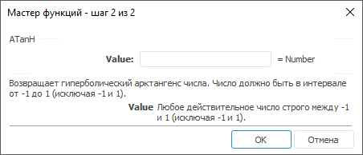

# ATanH: Регламентный отчёт, настольное приложение

ATanH: Регламентный отчёт, настольное приложение
-

# ATanH

[Мастер функций](../../UiReport_Organizational_master_function.htm)
 для функции ATanH выглядит следующим
 образом:

## Синтаксис

ATanH(Value)

## Параметры

Value. Действительное число,
 от которого требуется найти гиперболический арктангенс. Допустимые значения
 находятся в диапазоне от -1 до 1, исключая -1 и 1.

Примечание.
 В качестве параметра можно указывать как непосредственно число, так и
 адрес ячейки, в которой оно располагается.

## Описание

Возвращает гиперболический арктангенс числа.

## Комментарии

Гиперболический арктангенс числа - это значение, гиперболический тангенс
 которого равен числу. Число должно быть в интервале от -1 до 1, исключая
 -1 и 1.

## Пример

		 Формула
		 Результат
		 Описание

		 =ATanH(B6)
		 -0,5493
		 Гиперболический арктангенс числа, расположенного в ячейке B6.
		 Ячейка B6 содержит число -0,5.

		 =ATanH(0.9)
		 1,4722
		 Гиперболический арктангенс числа 0,9.

См. также:

[Мастер функций](../../UiReport_Organizational_master_function.htm)
 │ [Математические
 функции](UiReport_Func_math.htm) │ [ATan](UiReport_Func_Math_ATan.htm)
 │ [ATan2](UiReport_Func_Math_ATan2.htm)
 │ [Tan](UiReport_Func_Math_Tan.htm)
 │ [TanH](UiReport_Func_Math_TanH.htm) │
 [IMath.ATanH](MathLib.chm::/Interface/IMath/IMath.ATanH.htm)

		Справочная
		 система на версию 10.9
		 от 18/08/2025,
		 © ООО «ФОРСАЙТ»,
