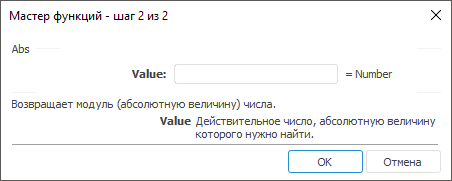

# Abs: Регламентный отчёт, настольное приложение

Abs: Регламентный отчёт, настольное приложение
-

# Abs

[Мастер функций](../../UiReport_Organizational_master_function.htm)
 для функции Abs выглядит следующим
 образом:

## Синтаксис

Abs(Value)

## Параметры

Value. Действительное число,
 абсолютную величину которого требуется найти.

Примечание.
 В качестве параметра можно указывать как непосредственно число, так и
 адрес ячейки, в которой оно располагается.

## Описание

Возвращает модуль (абсолютную величину) числа.

## Пример

		 Формула
		 Результат
		 Описание

		 = Abs(-4)
		 4
		 Модуль числа -4.

		 = Abs(4)
		 4
		 Модуль числа 4.

		 = Abs(A0)
		 6
		 Модуль числа, расположенного в ячейке A0. В ячейке А0 находится
		 число -6.

См. также:

[Мастер функций](../../UiReport_Organizational_master_function.htm) │
 [Математические
 функции](UiReport_Func_math.htm) │ [IMath.Abs](MathLib.chm::/Interface/IMath/IMath.Abs.htm) │
 [IMath.AbsI](MathLib.chm::/Interface/IMath/IMath.AbsI.htm)

		Справочная
		 система на версию 10.9
		 от 18/08/2025,
		 © ООО «ФОРСАЙТ»,
