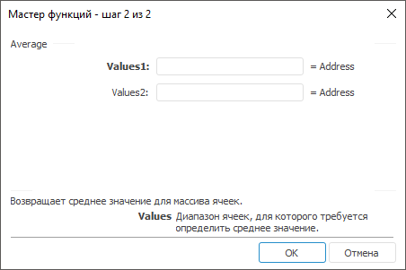

# Average: Регламентный отчёт, настольное приложение

Average: Регламентный отчёт, настольное приложение
-

# Average

[Мастер функций](../../UiReport_Organizational_master_function.htm)
 для функции Average выглядит следующим
 образом:

## Синтаксис

Average(Values1, ...)

## Параметры

Values1,
 Values2, …, ValuesN. Диапазон
 ячеек, для которого требуется определить среднее значение.

Примечание.
 В качестве параметра можно указывать как непосредственно число, так и
 адрес ячейки или диапазона ячеек, в которых оно располагается.

## Описание

Возвращает среднее значение для массива ячеек.

## Комментарии

Если в настройках формул отчёта не установлен флажок «[Проверять
 ссылки на пустые ячейки](../../../Reports/UiReport_Reports_Param4.htm#error_checking)» и:

	- диапазон ячеек, для которого требуется вычислить среднее значение,
	 полностью состоит из пустых значений, то функция возвращает значение
	 «#ЧИСЛО!»;

	- диапазон ячеек, для которого требуется вычислить среднее значение,
	 содержит несколько пустых значений, то вычисление функции происходит
	 без учёта пустых значений.

При установленном флажке «[Проверять
 ссылки на пустые ячейки](../../../Reports/UiReport_Reports_Param4.htm#error_checking)» пустые значения в ячейках расцениваются
 как нулевые.

## Пример

		 Формула
		 Результат
		 Описание

		 =Average(A1, A2, A3)
		 4,2333
		 Среднее значение массива, расположенного в ячейках A1, A2,
		 A3. Ячейка A1 содержит число 1,32, A2 содержит число 4,53, A3
		 содержит число 6,85.

		 =Average(1.15, 2.75, 3.81)
		 2,5700
		 Среднее значение указанного массива чисел.

См. также:

[Мастер функций](../../UiReport_Organizational_master_function.htm) │
 [Математические
 функции](UiReport_Func_math.htm) │ [Count](Count.htm) │ [IMath.Average](MathLib.chm::/Interface/IMath/IMath.Average.htm)

		Справочная
		 система на версию 10.9
		 от 18/08/2025,
		 © ООО «ФОРСАЙТ»,
