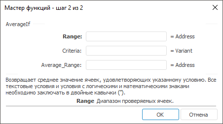

# AverageIf: Регламентный отчёт, настольное приложение

AverageIf: Регламентный отчёт, настольное приложение
-

# AverageIf

[Мастер функций](../../UiReport_Organizational_master_function.htm)
 для функции AverageIf выглядит
 следующим образом:

## Синтаксис

AverageIf(Range, Criteria[, AverageRange])

## Параметры

Range. Диапазон проверяемых
 ячеек;

Criteria. Условие, определяющее
 ячейки, для которых будет вычисляться среднее;

Примечание.
 Условие может быть в форме числа, выражения, ссылки на ячейку, текста
 или функции.

AverageRange. Фактические ячейки,
 для которых будет вычисляться среднее.

Примечание.
 Все текстовые условия и условия с логическими и математическими знаками
 необходимо заключать в двойные кавычки (“).

## Описание

Возвращает среднее значение ячеек, удовлетворяющих заданному условию.

## Пример

		 Формула
		 Результат
		 Описание

		 =AverageIf(A0:A3, ">0", B0:B3)
		 -2.5
		 Среднее значение массива, расположенного в ячейках от B0 до
		 B3, при условии, что в ячейках от A0 до A3 положительные значения.
		 В диапазоне от A0 до A3 расположены следующие числа: -2, 6, 4,
		 -8. В диапазоне от B0 до B3 расположены следующие числа: -6, 4,
		 -9, 5.

См. также:

[Мастер функций](../../UiReport_Organizational_master_function.htm) │
 [Математические
 функции](UiReport_Func_math.htm)

		Справочная
		 система на версию 10.9
		 от 18/08/2025,
		 © ООО «ФОРСАЙТ»,
