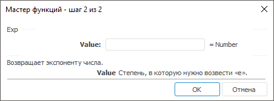

# Exp: Регламентный отчёт, настольное приложение

Exp: Регламентный отчёт, настольное приложение
-

# Exp

[Мастер функций](../../UiReport_Organizational_master_function.htm)
 для функции Exp выглядит следующим
 образом:

## Синтаксис

Exp(Value)

## Параметры

Value. Степень, в которую нужно
 возвести число е.

Примечание.
 В качестве параметра можно указывать как непосредственно число, так и
 адрес ячейки, в которой оно располагается.

## Описание

Возвращает результат возведения числа е в указанную степень.

## Комментарии

Число e равно 2,71828182845904 и является основанием натурального логарифма.

## Пример

		 Формула
		 Результат
		 Описание

		 =Exp(3)
		 20,0855
		 Число e, возведенное в третью степень.

		 =Exp(B6)
		 0,1353
		 Число e, возведенное в степень, расположенную в ячейке B6.
		 Ячейка B6 содержит число -2.

См. также:

[Мастер функций](../../UiReport_Organizational_master_function.htm)
 │ [Математические
 функции](UiReport_Func_math.htm) │ [Ln](UiReport_Func_Math_Ln.htm)
 │ [Log](UiReport_Func_Math_Log.htm)
 │ [Log10](UiReport_Func_Math_Log10.htm)
 │ [IMath.Exp](MathLib.chm::/Interface/IMath/IMath.Exp.htm)

		Справочная
		 система на версию 10.9
		 от 18/08/2025,
		 © ООО «ФОРСАЙТ»,
