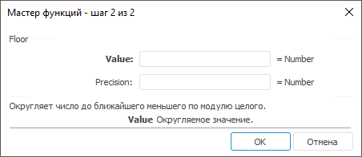

# Floor: Регламентный отчёт, настольное приложение

Floor: Регламентный отчёт, настольное приложение
-

# Floor

[Мастер функций](../../UiReport_Organizational_master_function.htm)
 для функции Floor выглядит следующим
 образом:

## Синтаксис

Floor(Value, Precision)

## Параметры

Value. Округляемое числовое
 значение;

Precision. Кратное, до которого
 требуется округлить.

Примечание.
 В качестве параметра можно указывать как непосредственно число, так и
 адрес ячейки, в которой оно располагается.

## Описание

Возвращает результат округления числа до ближайшего меньшего по модулю
 целого.

## Комментарии

Независимо от знака числа, округление всегда производится с недостатком.
 Если число уже кратно точности, то округление не будет производиться.

## Пример

		 Формула
		 Результат
		 Описание

		 =Floor(2.346, 0.01)
		 2,34
		 Округляет с недостатком число 2,346 до ближайшего числа, кратного
		 0,01.

		 =Floor(B6, C6)
		 -2
		 Округляет с недостатком число, расположенное в ячейке B6, до
		 ближайшего числа кратного значению, расположенному в ячейке C6.
		 Ячейка B6 содержит число -2,5, C6 содержит число -1.

		 =Floor(4.51, -1)
		 #ЧИСЛО!
		 Возвращает ошибку, т.к. числа 4,51 и -1 имеют разные знаки.

См. также:

[Мастер функций](../../UiReport_Organizational_master_function.htm)
 │ [Математические
 функции](UiReport_Func_math.htm) │ [Ceiling](UiReport_Func_Math_Ceiling.htm)
 │ [Even](UiReport_Func_Math_Even.htm)
 │ [Int](UiReport_Func_Math_Int.htm)
 │ [MRound](UiReport_Func_Math_MRound.htm)
 │ [Odd](UiReport_Func_Math_Odd.htm)
 │ [Round](UiReport_Func_Math_Round.htm)
 │ [RoundDown](UiReport_Func_Math_RoundDown.htm)
 │ [RoundUp](UiReport_Func_Math_RoundUp.htm)
 │ [Trunc](UiReport_Func_Math_Trunc.htm)
 │ [IMath.Floor](MathLib.chm::/Interface/IMath/IMath.Floor.htm)│ [IMath.FloorI](MathLib.chm::/Interface/IMath/IMath.FloorI.htm)

		Справочная
		 система на версию 10.9
		 от 18/08/2025,
		 © ООО «ФОРСАЙТ»,
