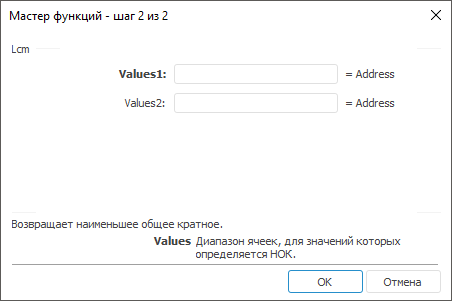

# Lcm: Регламентный отчёт, настольное приложение

Lcm: Регламентный отчёт, настольное приложение
-

# Lcm

[Мастер функций](../../UiReport_Organizational_master_function.htm)
 для функции Lcm выглядит следующим
 образом:

## Синтаксис

Lcm(Values1, …)

## Параметры

Values1, Values2,
 …, ValuesN. Диапазон ячеек, для
 значений которых необходимо определить наименьшее общее кратное.

## Описание

Возвращает наименьшее общее кратное двух и более целых чисел.

## Пример

		 Формула
		 Результат
		 Описание

		 =Lcm(B6:E6)
		 84
		 Наименьшее общее кратное чисел в диапазоне ячеек от B6 до E6.
		 В данном диапазоне расположены следующие числа: 21, 7, 14, 28.

См. также:

[Мастер функций](../../UiReport_Organizational_master_function.htm)
 | [Математические
 функции](UiReport_Func_math.htm) | [Gcd](UiReport_Func_Math_Gcd.htm)
 | [IMath.Lcm](MathLib.chm::/Interface/IMath/IMath.Lcm.htm)

		Справочная
		 система на версию 10.9
		 от 18/08/2025,
		 © ООО «ФОРСАЙТ»,
