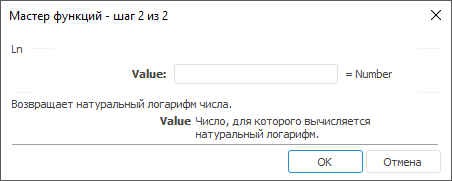

# Ln: Регламентный отчёт, настольное приложение

Ln: Регламентный отчёт, настольное приложение
-

# Ln

[Мастер функций](../../UiReport_Organizational_master_function.htm)
 для функции Ln выглядит следующим
 образом:

## Синтаксис

Ln(Value)

## Параметры

Value. Вещественное число больше
 нуля, для которого вычисляется натуральный логарифм.

Примечание.
 В качестве параметра можно указывать как непосредственно число, так и
 адрес ячейки, в которой оно располагается.

## Описание

Возвращает натуральный логарифм числа.

## Комментарии

Натуральный логарифм - это логарифм по основанию e (2,71828182845904).

## Пример

		 Формула
		 Результат
		 Описание

		 =Ln(2.7182)
		 1
		 Натуральный логарифм числа 2,7182.

		 =Ln(B6)
		 1,1314
		 Натуральный логарифм числа в ячейке B6. Ячейка B6 содержит
		 число 3,1.

См. также:

[Мастер функций](../../UiReport_Organizational_master_function.htm)
 │ [Математические
 функции](UiReport_Func_math.htm) │ [Exp](UiReport_Func_Math_Exp.htm)
 │ [Log](UiReport_Func_Math_Log.htm)
 │ [Log10](UiReport_Func_Math_Log10.htm)
 │ [IMath.Ln](MathLib.chm::/Interface/IMath/IMath.Ln.htm)

		Справочная
		 система на версию 10.9
		 от 18/08/2025,
		 © ООО «ФОРСАЙТ»,
