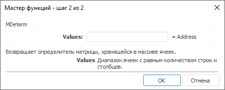
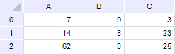

# MDeterm: Регламентный отчёт, настольное приложение

MDeterm: Регламентный отчёт, настольное приложение
-

# MDeterm

[Мастер функций](../../UiReport_Organizational_master_function.htm)
 для функции MDeterm выглядит следующим
 образом:

## Синтаксис

MDeterm(Values)

## Параметры

Values. Диапазон ячеек, в которых
 содержится числовой двумерный массив с равным количеством строк и столбцов.

Примечание.
 В качестве диапазона указываются адреса верхней левой и нижней правой
 ячеек, в которых расположена матрица.

## Описание

Возвращает определитель матрицы, хранящейся в массиве ячеек.

## Комментарии

Определитель матрицы — это число, вычисляемое на основе значений элементов
 массива.

Функция MDeterm возвращает значение
 ошибки, если:

	- какая-либо ячейка в массиве пуста или содержит текст;

	- количество строк в массиве не равно количеству столбцов.

## Пример

Исходная матрица:

		 Формула
		 Результат
		 Описание

		 =MDeterm(A0:C2)
		 8644
		 Определитель приведенной выше матрицы.

См. также:

[Мастер функций](../../UiReport_Organizational_master_function.htm)
 │ [Математические
 функции](UiReport_Func_math.htm) │ [MInverse](UiReport_Func_Math_MInverse.htm)
 │ [MMult](UiReport_Func_Math_MMult.htm)
 │ [IMath.MDeterm](MathLib.chm::/Interface/IMath/IMath.MDeterm.htm)

		Справочная
		 система на версию 10.9
		 от 18/08/2025,
		 © ООО «ФОРСАЙТ»,
