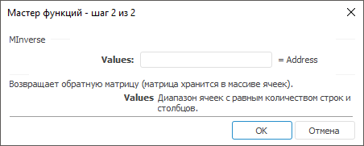
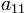

# MInverse: Регламентный отчёт, настольное приложение

MInverse: Регламентный отчёт, настольное приложение
-

# MInverse

[Мастер функций](../../UiReport_Organizational_master_function.htm)
 для функции MInverse выглядит
 следующим образом:

## Синтаксис

MInverse(Values)

## Параметры

Values. Диапазон ячеек, в которых
 содержится числовой двумерный массив с равным количеством строк и столбцов.

Примечание.
 В качестве диапазона указываются адреса верхней левой и нижней правой
 ячеек, в которых расположена матрица.

## Описание

Возвращает обратную матрицу для указанной матрицы.

## Комментарии

Функция возвращает массив, поэтому должна быть введена как [формула
 массива](../UiReport_Function.htm). Если ввести формулу в одну ячейку, то будет отображен элемент
  обратной
 матрицы.

Функция MInverse возвращает
 значение ошибки, если:

	- какая-либо ячейка в массиве пуста или содержит текст;

	- количество строк в массиве не равно количеству столбцов;

	- исходная квадратная матрица не может быть обращена. Определитель
	 такой матрицы равен 0.

## Пример

Исходная матрица (вверху) и ее обратная матрица (внизу) выглядят следующим
 образом:

		 Формула
		 Результат
		 Описание

		 =MInverse(A0:C2)
		 См. рисунок.
		 Обратная матрица приведенной выше матрицы.

Формулу в этом примере необходимо ввести как формулу массива. Для этого:

	- Введите формулу в ячейку;

	- Выделите диапазон по величине равный исходной матрице, начиная
	 с ячейки, содержащей формулу;

	- Нажмите клавишу F2, а затем — клавиши CTRL+SHIFT+ENTER.

Если формула не будет введена как формула массива, то будет отображено
 значение 
 обратной матрицы.

См. также:

[Мастер функций](../../UiReport_Organizational_master_function.htm)
 │ [Математические
 функции](UiReport_Func_math.htm) │ [MDeterm](UiReport_Func_Math_MDeterm.htm)
 │ [MMult](UiReport_Func_Math_MMult.htm)
 │ [IMath.MInverse](MathLib.chm::/Interface/IMath/IMath.MInverse.htm)

		Справочная
		 система на версию 10.9
		 от 18/08/2025,
		 © ООО «ФОРСАЙТ»,
