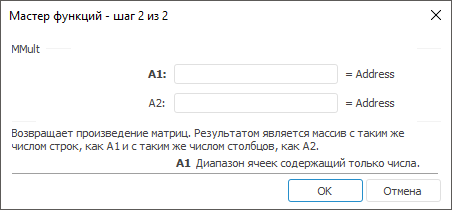
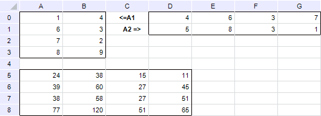

# MMult: Регламентный отчёт, настольное приложение

MMult: Регламентный отчёт, настольное приложение
-

# MMult

[Мастер функций](../../UiReport_Organizational_master_function.htm)
 для функции MMult выглядит следующим
 образом:

## Синтаксис

MMult(A1, A2)

## Параметры

A1. Диапазон ячеек, содержащих
 числовой массив;

A2. Диапазон ячеек, содержащих
 числовой массив.

Количество столбцов массива, передаваемого в параметре А1, должно совпадать
 с количеством строк массива, передаваемого в параметре А2.

Примечание.
 В качестве диапазона указываются адреса верхней левой и нижней правой
 ячеек, в которых расположена матрица.

## Описание

Возвращает матрицу чисел, равную произведению двух матриц (А1 и А2).
 Результатом является массив с таким же числом строк, как A1 и с таким
 же числом столбцов, как A2. Функция возвращает массив, поэтому должна
 быть введена как [формула массива](../UiReport_Function.htm).

Функция MMult возвращает значение
 ошибки, если:

	- какая-либо ячейка в массиве пуста или содержит текст;

	- число столбцов в параметре A1
	 отличается от числа строк в параметре A2.

## Пример

Исходные матрицы (вверху) и их произведение (внизу) выглядят следующим
 образом:

		 Формула
		 Результат
		 Описание

		 =MMult(A0:B3, D0:G1)
		 См. рисунок.
		 Произведение приведенных выше
		 матриц.

Формулу в этом примере необходимо ввести как формулу массива. Для этого:

	- Введите формулу в ячейку;

	- Выделите диапазон по величине равный исходной матрице, начиная
	 с ячейки, содержащей формулу;

	- Нажмите клавишу F2, а затем — клавиши CTRL+SHIFT+ENTER.

Если формула не будет введена как формула массива, то будет отображено
 значение 
 обратной матрицы.

См. также:

[Мастер функций](../../UiReport_Organizational_master_function.htm)
 │ [Математические
 функции](UiReport_Func_math.htm) │ [MDeterm](UiReport_Func_Math_MDeterm.htm)
 │ [MInverse](UiReport_Func_Math_MInverse.htm)
 │ [IMath.MMult](MathLib.chm::/IMath/IMath.MMult.htm)

		Справочная
		 система на версию 10.9
		 от 18/08/2025,
		 © ООО «ФОРСАЙТ»,
