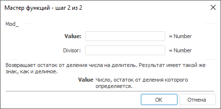

# Mod_: Регламентный отчёт, настольное приложение

Mod_: Регламентный отчёт, настольное приложение
-

# Mod_

[Мастер функций](../../UiReport_Organizational_master_function.htm)
 для функции Mod_ выглядит следующим
 образом:

## Синтаксис

Mod_(Value, Divisor)

## Параметры

Value. Число, остаток от деления
 которого определяется;

Divisor. Число, на которое
 нужно разделить (делитель). Не может быть равно нулю.

Примечание.
 В качестве параметра можно указывать как непосредственно число, так и
 адрес ячейки, в которой оно располагается.

## Описание

Возвращает остаток от деления числа на делитель.

## Комментарии

Результат имеет такой же знак, как и делимое.

## Пример

		 Формула
		 Результат
		 Описание

		 =Mod_(-5, 2.1)
		 -0,8
		 Остаток от деления числа -5 на число 2,1.

		 =Mod_(B6, C6)
		 2
		 Остаток от деления числа в ячейке B6 на число в ячейке C6.
		 Ячейка B6 содержит число 15, C6 содержит число 7.

См. также:

[Мастер функций](../../UiReport_Organizational_master_function.htm)
 │ [Математические
 функции](UiReport_Func_math.htm) │ [Quotient](UiReport_Func_Math_Quotient.htm)
 │ [IMath.Mod_](MathLib.chm::/Interface/IMath/IMath.Mod_.htm)

		Справочная
		 система на версию 10.9
		 от 18/08/2025,
		 © ООО «ФОРСАЙТ»,
