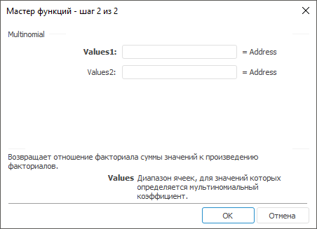

# Multinomial: Регламентный отчёт, настольное приложение

Multinomial: Регламентный отчёт, настольное приложение
-

# Multinomial

[Мастер функций](../../UiReport_Organizational_master_function.htm)
 для функции Multinomial выглядит
 следующим образом:

## Синтаксис

Multinomial(Values1, …)

## Параметры

Values1, Values2,
 …, ValuesN. Диапазон ячеек, для
 значения которых определяется мультиномиальный коэффициент.

## Описание

Возвращает отношение факториала суммы значений к произведению факториалов
 (мультиномиальный коэффициент).

## Пример

		 Формула
		 Результат
		 Описание

		 =Multinomial(B6:D6)
		 1260,0000
		 Мультиномиальный коэффициент чисел в диапазоне ячеек от B6
		 до D6. В данном диапазоне расположены следующие числа: 2, 3, 4.

См. также:

[Мастер функций](../../UiReport_Organizational_master_function.htm)
 | [Математические
 функции](UiReport_Func_math.htm) | [Fact](UiReport_Func_Math_Fact.htm)
 | [IMath.Multinomial](MathLib.chm::/Interface/IMath/IMath.Multinomial.htm)

		Справочная
		 система на версию 10.9
		 от 18/08/2025,
		 © ООО «ФОРСАЙТ»,
