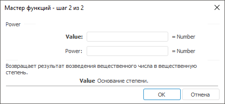

# Power: Регламентный отчёт, настольное приложение

Power: Регламентный отчёт, настольное приложение
-

# Power

[Мастер функций](../../UiReport_Organizational_master_function.htm)
 для функции Power выглядит следующим
 образом:

## Синтаксис

Power(Value, Power)

## Параметры

Value. Основание;

Power. Показатель степени,
 в которую возводится основание.

Примечание.
 В качестве параметра можно указывать как непосредственно число, так и
 адрес ячейки, в которой оно располагается.

## Описание

Возвращает результат возведения вещественного числа в вещественную степень.

## Пример

		 Формула
		 Результат
		 Описание

		 =Power(3,2)
		 9
		 Число 3, возведенное в степень 2.

		 =Power(B6, C6)
		 3,2409
		 Число в ячейке B6, возведенное в степень, расположенную в ячейке
		 С6. Ячейка B6 содержит число 1,5, С6 содержит число 2,9.

См. также:

[Мастер функций](../../UiReport_Organizational_master_function.htm)
 │ [Математические
 функции](UiReport_Func_math.htm) │ [IMath.Power](MathLib.chm::/Interface/IMath/IMath.Power.htm)│ [IMath.PowerI](MathLib.chm::/Interface/IMath/IMath.PowerI.htm)

		Справочная
		 система на версию 10.9
		 от 18/08/2025,
		 © ООО «ФОРСАЙТ»,
