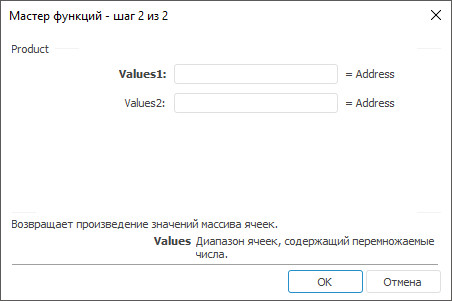

# Product: Регламентный отчёт, настольное приложение

Product: Регламентный отчёт, настольное приложение
-

# Product

[Мастер функций](../../UiReport_Organizational_master_function.htm)
 для функции Product выглядит следующим
 образом:

## Синтаксис

Product(Values1, …)

## Параметры

Values1, Values2,
 …, ValuesN. Диапазон ячеек, содержащих
 числа, произведение которых необходимо найти.

## Описание

Возвращает произведение значений массива ячеек.

## Пример

		 Формула
		 Результат
		 Описание

		 =Product(B6:D6)
		 -17,4
		 Произведение чисел, расположенных в диапазоне ячеек от B6 до
		 D6. В данном диапазоне расположены следующие числа: 1,5, -2,9,
		 4.

См. также:

[Мастер функций](../../UiReport_Organizational_master_function.htm)
 | [Математические
 функции](UiReport_Func_math.htm) | [IMath.Product](MathLib.chm::/Interface/IMath/IMath.Product.htm)

		Справочная
		 система на версию 10.9
		 от 18/08/2025,
		 © ООО «ФОРСАЙТ»,
