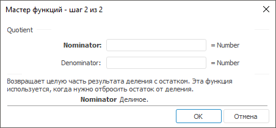

# Quotient: Регламентный отчёт, настольное приложение

Quotient: Регламентный отчёт, настольное приложение
-

# Quotient

[Мастер функций](../../UiReport_Organizational_master_function.htm)
 для функции Quotient выглядит
 следующим образом:

## Синтаксис

Quotient(Nominator, Denominator)

## Параметры

Nominator. Делимое;

Denominator. Делитель. Не может
 быть равным нулю.

Примечание.
 В качестве параметра можно указывать как непосредственно число, так и
 адрес ячейки, в которой оно располагается.

## Описание

Возвращает целую часть результата деления с остатком.

## Комментарии

Функция Quotient используется,
 когда нужно отбросить остаток от деления.

## Пример

		 Формула
		 Результат
		 Описание

		 =Quotient(5, 2)
		 2
		 Целая часть результата деления числа 5 на число 2.

		 =Quotient(B6, C6)
		 -6
		 Целая часть результата деления числа в ячейке B6 на число в
		 ячейке C6. Ячейка B6 содержит число 6,3, C6 содержит число -1.

См. также:

[Мастер функций](../../UiReport_Organizational_master_function.htm)
 │ [Математические
 функции](UiReport_Func_math.htm) │ [Mod_](UiReport_Func_Math_Mod_.htm)
 │ [IMath.Quotient](MathLib.chm::/Interface/IMath/IMath.Quotient.htm)

		Справочная
		 система на версию 10.9
		 от 18/08/2025,
		 © ООО «ФОРСАЙТ»,
