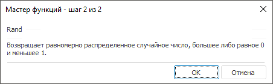

# Rand: Регламентный отчёт, настольное приложение

Rand: Регламентный отчёт, настольное приложение
-

# Rand

[Мастер функций](../../UiReport_Organizational_master_function.htm)
 для функции Rand выглядит следующим
 образом:

## Синтаксис

Rand: Регламентный отчёт, настольное приложение()

## Параметры

Данная функция не содержит параметров.

## Описание

Возвращает равномерно распределенное случайное число, большее либо равное
 0 и меньшее 1.

## Комментарии

Новое случайное вещественное число возвращается при каждом вычислении
 листа.

## Пример

		 Формула
		 Результат
		 Описание

		 =Rand
		 Меняется.
		 Случайное число большее либо равное 0 и меньшее 1.

См. также:

[Мастер функций](../../UiReport_Organizational_master_function.htm)
 │ [Математические
 функции](UiReport_Func_math.htm) │ [RandBetween](UiReport_Func_Math_RandBetween.htm)
 │ [IMath.Rand](MathLib.chm::/Interface/IMath/IMath.Rand.htm)

		Справочная
		 система на версию 10.9
		 от 18/08/2025,
		 © ООО «ФОРСАЙТ»,
